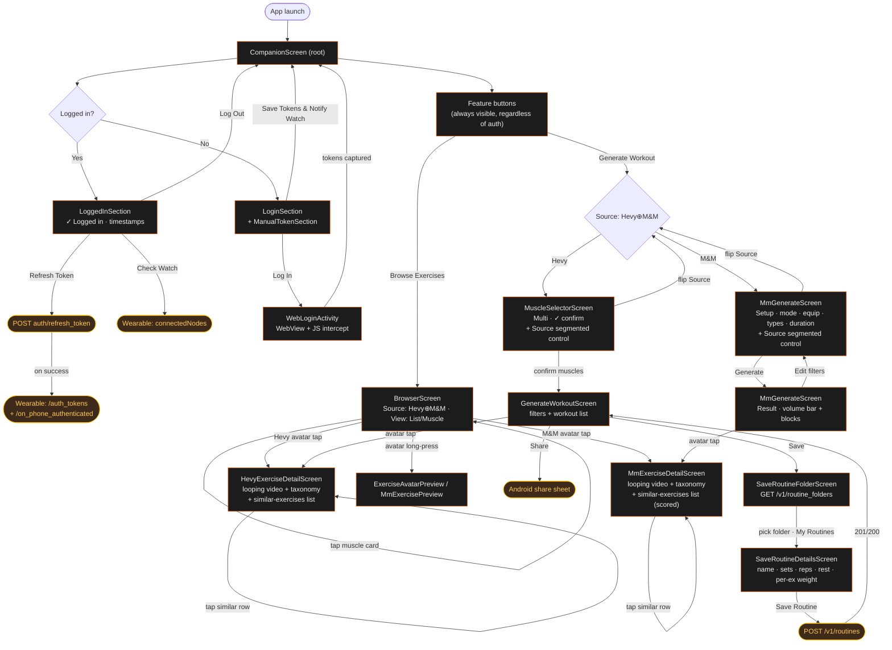

# valkyria — Companion Phone App PRD

**Platform**: Android (min SDK 28, target SDK 35, compile SDK 36)
**User-facing app name**: **valkyria** (lowercase, `strings.xml::app_name`)
**Package / namespace**: `com.example.hevycompanion` (Kotlin namespace)
**`applicationId`**: `com.example.hevywatch` — deliberately matches the watch's applicationId, see *Application identity*
**Purpose**: Bridges authentication tokens to the paired Wear OS watch and surfaces a few standalone workout-prep features (browse exercises by muscle, generate a workout) that hit the public Hevy API directly.

**Shared code**: The companion and watch apps consume a common pure-JVM `:core` module (`core/src/main/kotlin/com/example/hevycore/`) that holds the wire-critical constants both sides used to duplicate: Wearable MessageAPI path strings (`WearMessagePaths`), the assisted-bodyweight template IDs + effective-work conversions (`AssistedBodyweight`), the warmup muscle-group tables + protocol table + rounding rules (`WarmupConstants`), and the progressive-overload look-back window / rep floor / increment (`PoConstants`). Any change to one of these constants now lands in one place, and the compiler enforces sync — before extraction, the companion's `ProgressiveOverload` and `WarmupAdvisor` maintained their own copies of every table and drift could go undetected. `:core:auth` (SecurePrefs / AuthPrefs unification) is deferred.

> **Naming**: The app was previously called "HevyWatch / Hevy Companion", then "Barbell". The current rebrand to **valkyria** (lowercase, valkyria-silhouette-on-orange-disc icon, `BrandOrange #FE6A16` retained) is now reflected in the user-facing strings; in-source class/symbol names are still `Hevy*` (e.g. `HevyAuthApi`, `HevyPublicApi`, `HevyImageUrlMap`) and the backend it talks to is still **Hevy**'s API. So when this PRD says "the Hevy API" / "Hevy's CDN" it means the third-party service; when it says "valkyria" it means the user-facing app.

---

## Screens

### CompanionScreen (Root)
**File**: `MainActivity.kt`

Vertically scrollable column showing either LoggedInSection or LoginSection based on auth state. Header: **"valkyria"** (was "Hevy Companion" → "Barbell" → "valkyria") + the description "Bridges auth tokens from your account to the Wear OS watch.". Status messages at bottom in monospace (red for errors, gray for info). Polls SharedPrefs every 60s to keep the timestamp display current.

The six feature buttons (**Browse Exercises / Generate Workout / Strength Overview / Exercise Alternatives / Recents / Routine Trends**) live BELOW the LoggedIn/Login section in `CompanionScreen` itself — they always render regardless of auth state, because the Hevy-side flows hit the public Hevy API with the bundled api-key, and the M&M flows run entirely off the bundled `mm_catalog_runtime.json` asset. (Strength Overview, Exercise Alternatives and Recents also use the public api-key, which is account-scoped, so they read the user's own workout/exercise history and the exercise catalog without the watch-token login.)

**Merge history** (was five buttons): the original surface had separate `Browse Exercises by Muscle`, `Hevy Exercise List`, `M&M Exercise List`, `Generate Workout`, and `Generate Workout (M&M)` entry points. Two collapse passes:

1. **Browser merge** — the three browse-side buttons folded into one **Browse Exercises** button which opens the unified [BrowserScreen](#unified-browser) with a Source segmented control (Hevy XOR M&M) and a View segmented control (List vs. Muscle Grid).
2. **Generator merge** — the two generate buttons folded into one **Generate Workout** button which opens the unified [Generator entry coordinator](#unified-generator-entry). A Source segmented control on the Setup phase lets the user flip catalogs before committing to a workout. Past Setup the toggle hides because the result is bound to the algorithm's catalog. The two prescription algorithms (`WorkoutGenerator.generate` for Hevy / `MmGenerator.generate` for M&M) and the two result screens stay independent — they're too different to fully merge without a heavy refactor that wouldn't pay off.

### Status-bar area handling
Android 15 forces edge-to-edge layout for any app with `targetSdk = 35` and ignores `WindowCompat.setDecorFitsSystemWindows` opt-out attempts. Rather than handling system-bar insets per-screen, `MainActivity` reserves a single slot at the top of the layout sized to `WindowInsets.statusBars` height and paints it solid black, so the OS status bar stays legible (white system icons against black) regardless of which app surface is showing below. Every screen (`CompanionScreen`, `BrowserScreen`, `MuscleSelectorScreen`, `GenerateWorkoutScreen`, `SaveRoutineFolderScreen`, `SaveRoutineDetailsScreen`, `MmGenerateScreen`) renders inside the `Surface` underneath that slot and never has to know about insets.

### Theme — `ValkyriaTheme`
Lives at `com.example.hevycompanion.ui.Theme.kt`. Wraps Material 3's `MaterialTheme` with a hand-tuned **dark** `ColorScheme` so the companion app stops falling through to Material 3's default purple-blue:

- **`primary` = `BrandOrange` `#FE6A16`** (the valkyria launcher disc colour) — drives the "Save Routine" CTA, the "✓ Logged in" status text, the muscle-selector primary chip state, and every `MaterialTheme.colorScheme.primary` reference site.
- **`secondary` = `BrandAmber` `#FFC107`** — matches the watch's `ChipPalette.WarmupAmber` so warmup / advisor accents read consistently across both apps.
- **`background` = `Color.Black`** so the reserved status-bar slot blends seamlessly with the rest of the surface; **`surface` = `#111111`** for slightly elevated cards.
- **`onPrimary` = `Color.Black`** so the orange CTAs render with black foreground text rather than white-on-orange (legibility wins on a brand-saturated colour).
- **`error` = `#E34B37`** — same red the watch uses, kept consistent across both apps.

`MainActivity.setContent` wraps the whole tree in `ValkyriaTheme {}` (was `MaterialTheme {}` with no scheme, then `BarbellTheme {}`). The theme is currently **forced dark** (`useDarkTheme = true`); the function still accepts a parameter so a future settings toggle can route through `isSystemInDarkTheme()` without rewriting call sites.

### LoggedInSection
Shows when authenticated:
- **"✓ Logged in"** header rendered in `MaterialTheme.colorScheme.primary` (BrandOrange `#FE6A16`). The check-mark is part of the literal — the heading is "✓ Logged in", not "Logged in" (and not green — that was a pre-rebrand choice).
- Brief explainer text: "WatchBridgeService runs in the background. When the watch reconnects it sends `/request_auth` and the service responds with your tokens automatically."
- Token timestamps in monospace:
  - "Token refreshed: [dd MMM yyyy HH:mm]" or "Never"
  - "Token pushed:    [dd MMM yyyy HH:mm]" or "Never"
  - "API spoof:       X.Y.Z (NNNNN)" or "Unknown — waiting for first sync"
  - "API synced:      [dd MMM yyyy HH:mm]" or "Never" — last successful fetch of `api-versions/active.json` from the repo
  - "API pushed:      [dd MMM yyyy HH:mm]" or "Never" — last successful `/api_version` push to the watch
- Action buttons (in this section):
  - **Check Watch** (outlined) — queries Wear network connectivity
  - **Refresh Token** (outlined) — manual token refresh via API; on success the refreshed tokens are pushed to the watch automatically
  - **Log Out** (filled, `errorContainer` colours) — clears all auth data + cookies

  *(Formerly also had a "Push Tokens to Watch" button. Removed: Refresh Token already pushes on success, so the standalone push button was redundant.)*

> The two feature buttons (**Browse Exercises**, **Generate Workout**) are NOT inside `LoggedInSection`. They live in `CompanionScreen` directly underneath the `LoggedIn`/`Login` section divider and surface regardless of auth state — see *CompanionScreen* above and *Navigation* below.

### LoginSection
Shows when not authenticated:
- **"Log in"** header (was "Log in to Hevy" pre-rebrand)
- Explainer text: "Opens the source-app website so reCAPTCHA can verify you normally. Your credentials are pre-filled — just tap Log In."
- **Log In** button (was "Log In via Hevy" pre-rebrand) — launches `WebLoginActivity`, which loads the real hevy.com login page. Credentials are never held by this app: the user fills the form themselves (a password manager's autofill works normally), and the WebView only intercepts the `/login` response to capture the bearer token
- Loading spinner when in progress
- A `HorizontalDivider` then `ManualTokenSection` (still inside `LoginSection`)

### ManualTokenSection (collapsible)
Fallback for proxy-intercepted tokens. Toggles between "▼ Paste Tokens Manually" / "▲ Hide Manual Token Entry":
- Explainer: "Fallback: intercept an auth response from the official source app with a proxy (Charles, mitmproxy) and paste the three token fields here." (Pre-rebrand this said "the Hevy app" instead of "the official source app".)
- Three text fields: access_token, refresh_token, expires_at
- "Save Tokens & Notify Watch" button (disabled until access_token + refresh_token are non-blank)

### Strength Overview
**Files**: `overview/ExerciseMaxScreen.kt`, `overview/ExerciseMaxViewModel.kt`, `overview/ExerciseMaxRepo.kt`, `overview/ExerciseMax.kt`, `overview/ExerciseMaxCsv.kt`

Read-only table of the user's highest *successfully managed* weight per weight-rep exercise, grouped by primary **muscle group** (collapsible), searchable by name and filterable by equipment. Opened from the **Strength Overview** home button; closed via Back (system or the in-screen "‹ Back").

**Grouping / collapse** (`groupByMuscle` → `List<MuscleSection>`, each holding a flat `List<ExerciseMaxRow>`): each muscle-group header is tappable to expand/collapse, with a ▸/▾ twisty and an exercise-count badge. Muscle groups default **collapsed** (a tidy top-level overview you drill into); expand state lives in `ExerciseMaxViewModel.expandedMuscles`, surviving leaving/re-entering the screen. Each exercise row shows `Equipment · Date` as a subtitle and the kg on the right. Equipment is shown per-row and offered as a filter — it is **not** a sub-grouping tier (an earlier draft nested exercises under equipment sub-headers; replaced by the filter).

**Search** (`ExerciseMaxViewModel.query`): an `OutlinedTextField` above the list filters exercises by case-insensitive name substring. While any search/equipment filter is active (`isFiltering`), all muscle groups auto-expand so matches are visible without tapping; clearing the filter restores the manual collapse state.

**Equipment filter** (`equipmentFilter`, multi-select `FilterChip` row): one chip per distinct equipment in the data (`knownEquipment`); selecting chips narrows to those equipments (empty = all). Muscle groups whose exercises are all filtered out drop off the list automatically (empty groups aren't emitted). When the search + filter exclude everything, a "No exercises match" state shows.

**Sort** (`OverviewSort`, segmented control): exercises within each muscle group order by **Name** (A→Z, default) or **Date** (the date the highest weight was hit, most-recent first). Muscle sections always stay alphabetical. ISO-8601 start times share one offset, so `DATE_DESC` is a plain reverse-lexicographic compare with title as the tiebreak.

**Rows are not tappable** (no deeplink). Research against the decompiled phone app + on-device testing (see [[reference_hevy_no_exercise_deeplink]] in agent memory) found the official Hevy Android app has **no deeplink to an exercise detail page**: web `hevy.com/exercise/{id}` opens the browser (no `/exercise` App Link) and requires login, the in-app Share button mints no link, and every `hevy://…` exercise-path variant just opens the app to the home tab. By the user's choice the rows are left non-tappable rather than bouncing out to a browser login.

**"Highest KG" rule** (`ExerciseMax.highestQualifying`, pure/unit-tested): within a single workout, look at the *normal* sets that hit **≥15 reps**; if there are **≥3** such sets, that workout qualifies and its value is the **average** of those sets' weights (so a 20 / 22.5 / 25 kg session scores 22.5 kg). The headline figure is the highest qualifying average across the exercise's whole history, tagged with that workout's date. Warmup/dropset/failure sets and any set below the rep floor are ignored. This mirrors the way the watch's progressive-overload base averages a qualifying workout's sets, collapsed to a single best-ever number. (Note: this "highest qualifying across all history" figure is a *separate* strength-overview metric; it does not apply PO's 3-workout recency weighting.) Exercises with no qualifying workout are dropped from the list entirely.

**Estimated 1RM column** (`ExerciseMax.epley1rm`, pure/unit-tested): each row renders a dimmed `1RM ~<kg>` line under the headline weight. The estimate uses **Epley** — `w × (1 + reps/30)` — computed from the *single hardest set* of the winning workout rather than from the average, so it reflects the heaviest thing actually lifted in that session. `reps == 1` short-circuits to the weight itself (raw Epley returns `1.033 × w` at one rep, which is nonsense — a set of one IS the 1RM). Epley rather than Brzycki because Brzycki's `36/(37−r)` diverges sharply above ~12 reps (≈9 % higher at 15 reps, widening after). **Caveat worth carrying:** every 1RM formula is fitted on roughly 1–10 rep sets and over-estimates past that; this app's training model is 15-rep sets, which sits outside the fitted range. Read the number as a *normalising* figure for comparing exercises against each other over time, not as a weight to attempt. The column is empty when the history lacked usable weight+reps.

**Data flow** (`ExerciseMaxRepo`, all on the public api-key):
1. `ExerciseTemplateRepo.getOrFetch()` — the cached catalog (title / primary muscle / equipment).
2. `GET /v1/workouts` (paged) — to find which templates the user has actually performed, so history is only fetched for those (avoids ~300 calls for untouched catalog entries).
3. `GET /v1/exercise_history/{id}` for each performed `weight_reps` template — fetched at concurrency 6 (phone data, not the watch's BT link), scored by `highestQualifying`. A single failed history fetch omits that one exercise rather than failing the whole screen.

The loading state shows live progress ("Scanning history 23 / 101"). On error, a Retry button re-runs the load.

**CSV export**: the header's **Export CSV** action (`ExerciseMaxViewModel.exportCsvIntent` → `ExerciseMaxCsv.toCsv(rows, sort)`, RFC-4180 with quoting) writes `strength-overview.csv` to `cacheDir/exports/` and shares it via `FileProvider` (`${applicationId}.fileprovider`, paths in `res/xml/file_paths.xml`) through the system chooser. Columns: `Muscle Group, Exercise, Equipment, Highest KG, Est 1RM KG, Date` (the 1RM cell is empty when unavailable). The export reflects the **currently visible** rows — it honours the active search + equipment filter and sort (collapse state doesn't affect it), so it matches the on-screen table.

> **Type-string note**: the public `/v1/exercise_templates` returns `type: "weight_reps"` — NOT the watch private API's `"weight_and_reps"`. The filter is on `weight_reps`. The watch's `ProgressiveOverload` code wasn't reusable as-is (it's bound to the private Bearer client and the private type string), but the scoring math is intentionally the same shape.

---

### Recents
**Files**: `recents/RecentsScreen.kt`, `recents/RecentsViewModel.kt`, `recents/WorkoutDetailScreen.kt`, `recents/WorkoutDetailViewModel.kt`, `recents/WorkoutCompletion.kt`, `recents/SubstitutionMap.kt`, `recents/RecentsFormat.kt`, `recents/ProgressiveOverload.kt`, `recents/WarmupAdvisor.kt`, `recents/ExerciseAdvisor.kt`, `recents/ExerciseAdvice.kt`, `recents/RecentsAdviceRepo.kt`, `recents/ResumeWorkoutScreen.kt`, `recents/ResumeWorkoutViewModel.kt`, `recents/ResumeRequestBuilder.kt`, `recents/SubmitProgress.kt`, `data/BodyweightPrefs.kt`, `data/HevyPrivateApi.kt`, `wear/WatchResumeSender.kt`

The companion port of the watch app's **Recent** page + **Workout Detail** screen. Opened from the **Recents** home button; closed via Back (system or the in-screen "‹ Back"). Public api-key, account-scoped, so it works regardless of the watch-token login state — same as Browser / Generator / Strength Overview.

**Recents list** (`RecentsViewModel` → `RecentsScreen`): pages `GET /v1/workouts` (newest-first, `pageSize` 10) up to a `LIMIT` of 30, mapping each to a `RecentWorkout` (id / title / start_time / routine_id), then keeps **only the workouts logged from a PO-folder routine**. Rows sort by `start_time` descending (defensive — the API already returns newest-first) and render a tappable title + `"MMM d, ''yy  HH:mm"` datetime. Standard loading / error (Retry) / empty states, mirroring `ExerciseMaxScreen`. Tapping a row sets `selectedWorkoutId`; the host then renders the Workout Detail screen over the list. The list supports **pull-to-refresh** (Material3 `PullToRefreshBox`): swiping down re-runs `fetchRecents()` via `RecentsViewModel.refresh()`, which keeps the existing rows on screen and drives the pull indicator through `isRefreshing` (rather than the full-screen `isLoading` spinner the initial open/Retry use); concurrent pulls are no-ops while a refresh is in flight.

**PO-only scope**: The public api has no list-routines endpoint, so the filter resolves each distinct `routine_id` in the fetched batch via the single-routine endpoint (`getRoutine`, the same call Workout Detail makes) — concurrently — and keeps the ids whose `folder_id` is in `ProgressiveOverloadFolders.IDS`. A routine that fails to resolve is treated as non-PO (its workouts are hidden). The membership check + filter live in `RecentsViewModel.poRoutineIds` (suspend, network) and the pure companion helper `filterToPoRoutines` (unit-tested in `RecentsPoFilterTest`). Mirrors the watch app's PO-only Recents page.

**Workout Detail** (`WorkoutDetailViewModel` → `WorkoutDetailScreen`, keyed on `workoutId`): fetches `GET /v1/workouts/{id}` for the full logged detail (exercises + sets), and — when the workout carries a `routine_id` — `GET /v1/routines/{id}` for the prescription, then computes the completeness breakdown. A workout with no routine (or an unfetchable one) falls back to listing the logged exercises with their `W + N` set counts. `load(workoutId)` is idempotent per id so re-composition doesn't re-fetch.

**Completeness logic** (`WorkoutCompletion.buildCompletionStatuses`): a verbatim port of the watch's `WorkoutDetailViewModel.buildCompletionStatuses` — three passes producing `ExerciseCompletionStatus` rows with status `COMPLETE` / `SUBSTITUTED` / `INCOMPLETE` / `MISSING` / `EXTRA`, sorted by that enum order:
1. **Exact** — each routine slot claims the workout exercise with the same `exercise_template_id`; ≥ prescribed normal sets → COMPLETE, > 0 → INCOMPLETE, else → MISSING.
2. **Substitution** (PO folders only) — a still-MISSING slot in a `SubstitutionMap` group claims any unclaimed workout exercise from the same group, marked SUBSTITUTED (the row shows the exercise actually done; `prescribedTitle` names the slot it filled). A substitute with logged normal sets is preferred, but an **in-progress swap that only has warmups logged so far still fills the slot** (as an incomplete SUBSTITUTED row) — otherwise a swapped-in exercise with no normal sets yet would leave its slot MISSING and surface itself as EXTRA.
3. **Extras** (PO folders only) — unclaimed logged exercises that aren't themselves a prescribed slot render as EXTRA.

**Warmup-aware completeness** (mirrors the watch): each row also carries `expectedWarmupSets` — how many warmups `WarmupAdvisor.suggest` would prescribe at the **planned PO target weight** (the weight the live advisor ramped to), using the exercise's catalog metadata (`ExerciseTemplateRepo.getOrFetch`, cached 7-day TTL) + the bodyweight setting. `ExerciseCompletionStatus.isComplete` is then `recordedNormalSets >= prescribedNormalSets && recordedWarmupSets >= expectedWarmupSets`, so an exercise with all working sets done but its genuinely-advised warmups skipped is **not** complete — but one done at-or-below its target isn't penalised for warmups it never warranted. The target is the `advice` panel's PO target (`RecentsAdviceRepo.compute`, whose `historyBefore` windows history to sessions logged **strictly before the viewed workout's `start_time`** and drops the viewed workout by id), threaded back into `buildCompletionStatuses(... poTargetByTemplate)` and applied by `expectedWarmupSetsForCompletion`. The time window (not just id-exclusion) matters: otherwise **later, heavier** sessions inflate the recency-weighted target and a past workout is judged against a **forward-looking** target — the Leg-Press-advised-3-then-later-sessions-push-it-to-4 case (mirrors the watch's `computePoTargets` fix). The two Resume callers keep the id-only default (a resumed workout is the current one — no later sessions exist). **When there is NO PO target** — advice hasn't landed yet (empty `poTargetByTemplate` on first render), a first-time exercise / no usable prior normal history, or any off-routine substitute/extra — `expectedWarmupSets` is held to **`recordedWarmupSets`** (the warmup gate is not asserted). It is **never** recomputed from the logged working weight: doing so let a heavier-than-planned lift retroactively demand more warmups than were recorded (the **adductor-at-50kg** bug — MEDIUM group, 1 warmup done at a ~40kg plan, working sets pushed to 55kg → recompute wants 2 → the completed exercise falsely reads incomplete). The heavier lift only raises **next** session's target. Because advice resolves async, the VM builds statuses once with **no** targets (all held to recorded — no false incomplete flash), then **rebuilds** them with the targets when advice lands (the blue→green settle for exercises that genuinely warranted warmups against the plan — the rear-delt-at-30kg case). Degrades safely: no metadata / no weight → `expectedWarmupSets = 0` (never a false incomplete).

**Engine parity with the watch (the chips must agree).** This screen is the *reference* the watch's Workout Detail was aligned to: the watch previously read a phantom missing-warmup the phone didn't, because its PO target came from a possibly-stale `exerciseHistoryCache` while the phone's `RecentsAdviceRepo.compute` always fetches fresh, and because the watch surfaced the routine's placeholder weight where the phone resolves `PoOutcome.NONE` (null → warmup gate held to recorded). The companion side is unchanged; the watch now force-refreshes history before comparing and nulls its target on no-usable-history to match this behaviour (PRD-WATCH-APP.md §"Warmup-aware completeness" → *Engine parity with the companion*). Both PO engines are otherwise identical ports (uniform 1.0 kg increment, same qualifying / recency-weighted-average / carry-forward).

**PO gating** (`ProgressiveOverloadFolders.IDS`): substitution + extras apply only to routines whose `folder_id` is a Progressive-Overload folder. The watch reads this from a user-configurable `ProgressiveOverloadStore` (SharedPreferences, default `{"2525049"}`); the companion has no such setting and pins the default constant. The curated substitution-group table now lives in `:core` (`com.example.hevycore.exercise.SubstitutionMap`) — the watch's `com.example.hevywatch.data.SubstitutionMap` and the companion's `com.example.hevycompanion.recents.SubstitutionMap` are thin delegators (watch keeps a per-file `NAMES` catalog for the swap-screen titles) so the two apps physically share the group definitions and can't drift. The table deliberately keeps the *flat* **Chest/Bench-Press** group (every machine/Smith/cable/barbell/dumbbell/band chest- & bench-press variant interchangeable; Close-Grip Bench `35B51B87` excluded as triceps-primary). Regression-pinned by `com.example.hevycore.exercise.SubstitutionMapTest`.

**Unified chip** (`ExerciseChipUi.kt` — the Material3 port of the watch's `ExerciseChipUi`, so the companion Workout Detail chip reads identically to the watch's): each exercise row shows
  - **state** via background tint — green when `isComplete` (all normal sets **and** advised warmups logged), blue when partially logged, red when nothing's logged. There is **no** separate tint for swaps or extras (the old violet-swap / grey-extra are gone).
  - a **kind tag** (`swap` / `extra`) as dim text next to the title — the original slot name is not shown. The `Status` enum still records SUBSTITUTED / EXTRA for the tag + sort order.
  - **`X/Y W`** (warmups done/total, amber, hidden when none) and **`X/Y N`** (normal done/total).
  - the **weight**: the next-session **PO target** (green when bumped — from the async `advice`) until the first normal set is logged (a still-missing slot), then the **logged working weight**. Amber `~` for a similar-exercise estimate.
  - tap still expands the PO-target + advised-warmup detail panel (`AdvicePanel`).

**Inline PO target + warmup advisor** (`ProgressiveOverload.kt`, `WarmupAdvisor.kt`, `ExerciseAdvisor.kt`, `ExerciseAdvice.kt`, `RecentsAdviceRepo.kt`): each exercise row on Workout Detail is **tap-to-expand**, revealing the watch's two flagship in-workout features surfaced read-only:

- **Next-session progressive-overload target** — the watch's recency-weighted-average algorithm (PRD-WATCH-APP.md §"Progressive Overload"), ported verbatim onto the public API's `ExerciseHistoryEntry` (set-type string `"normal"` vs the watch's private model). Shown as "Next session: X kg", green when a qualifying workout triggered a bump (with the "(was Y kg)" base), plain when it's just the last session's weight carried forward. Assisted-bodyweight exercises (dips, pull-ups) progress by *lowering* logged kg, computed in effort space (`bodyweight − logged`).
- **Advised warmup sets** — the watch's `suggestWarmupSets` ported verbatim (muscle-group × working-weight buckets, the protocol table, equipment rounding + barbell 20 kg floor, unilateral doubling, assisted effort-space conversion). The working weight is the PO target.
- **Last session avg** — "Last session avg: X kg", the mean of the **normal** sets from the most recent prior session (`LastSessionStats.avgLastSessionNormalKg`, the companion port of the watch's `LastSessionStats.avgNormalWeightKg`). Warmup/drop/failure and zero-weight sets are excluded; omitted for bodyweight-only exercises with no weighted normal set. Computed from the same (currently-viewed-workout-excluded) history the PO target uses and carried on `ExerciseAdvice.avgLastNormalKg`.

The per-exercise history fetch reuses the Strength Overview's pattern (concurrency-6 on the public api-key, via `RecentsAdviceRepo`). PO history **excludes the currently-viewed workout** so the target resolves against prior *completed* sessions — the same filter the watch applies when resuming. The pure pieces are unit-tested (`ProgressiveOverloadTest`, `WarmupAdvisorTest`, `LastSessionStatsTest`).

**Bodyweight setting** (`data/BodyweightPrefs.kt`, default 57 kg — the watch default): edited inline on the home screen (`BodyweightSetting` in `MainActivity`). Feeds the PO + warmup advisors' assisted-exercise math only; ignored for every other exercise. The watch reads the same value from its Settings screen; the companion has no settings screen so the field sits under the feature buttons.

**Resume** (`ResumeWorkoutViewModel.kt`, `ResumeWorkoutScreen.kt`, `ResumeRequestBuilder.kt`, `wear/WatchResumeSender.kt`): when a workout isn't fully done (`canContinue` — any non-EXTRA slot with `!isComplete`: missing normal sets **or** missing advised warmups, mirroring the watch), a **Resume** action appears on Workout Detail. Tapping it opens a chooser (`ResumeChooserDialog`). Both resume options share the dialog's confirm slot and the dismiss slot carries a real **Cancel** — "On watch" used to sit in the dismiss slot, which read as the cancel action and left an accidentally-opened dialog with no explicit way out:

- **Resume here** — opens an in-companion logging screen listing the remaining work per still-unfinished slot: the prescribed-minus-recorded normal sets pre-filled with the PO target weight + the routine's reps, **plus any still-owed advisor warmups** (`missingWarmups` = the advisor's PO-target warmup list minus those already logged). Because the warmup list is judged at the same PO target as the chip's completion, an exercise offers warmups to log **iff its chip reads warmup-short** — including one whose normal sets are all done but whose advised warmups were skipped (the bug this fixed: those exercises used to be invisible on resume). An exercise with nothing left (all normals + all advised warmups done) is dropped; if every exercise is done the screen shows "Nothing left to log". Two affordances mirror the watch's live logger: **+ Add set** appends an extra normal set (pre-filled from the last one — the watch's "+1 Set" prompt; `ResumeWorkoutViewModel.addSet`), and an untouched PO-folder exercise with substitutes shows a **Swap** button that opens a picker of alternatives **ordered by recency of use** (`lastUsedEpochMsOf`; titles from the catalog, `SubstitutionMap.substitutesFor`). Picking one rebuilds that slot against the substitute's own PO target + advised warmups (`applySwap`, logged against the substitute's template id), exactly like the watch's in-workout swap. Each row starts **unchecked** — the pre-filled weight/reps are a prescription (the PO target, an advised warmup, the routine's reps), not a record of what happened, so hitting Submit untouched logs nothing. The user checks off (and edits, if needed) each set actually performed and Submits, which **replaces** the workout exactly as the watch does (`d12a5f2 "resume via POST + DELETE on private v2"`): a merged `POST /v2/workout` on the **private Bearer client** (`HevyPrivateApi`, mirroring the watch's `HevyApiClient.createPrivate` — `Authorization: Bearer` + `X-Api-Key` + the spoofed `Hevy-App-Version`/`Build` + `Hevy-Platform: wearos`), then a best-effort `DELETE /workout/{id}` of the original. The original session's **biometrics pass straight through** the merge (`buildPostV2`), so the HR chart survives the replace — the phone adds none of its own. The private v2 detail (`GET /workout/{id}`) is fetched best-effort at load. Before each private call the VM runs `refreshTokenIfNeeded()` — a port of the watch's `HevyApp.refreshTokenIfNeeded` (proactively refreshes when the token is within 60 s of expiry via the shared-mutex `RefreshTokenInteractor`, then pushes the rotated tokens to the watch so the dual-refresh bridge stays healthy). `ResumeWorkoutViewModel.isTokenExpiringSoon` is unit-tested (`TokenExpiryTest`).
  - **Fallback** — if the v2 detail isn't available (not logged in, or the gated route 404s) **or the private POST attempts are exhausted**, submit falls back to an in-place `PUT /v1/workouts/{id}` on the public api-key (`buildPutV1`, built with `buildHevyPublicApi(serializeNulls = false)`), exactly the watch's "v2 unavailable / exhausted → v1 PUT" branch — biometrics are lost on this path, as on the watch. Both builders share one merge (original verbatim + new sets appended + filled MISSING slots added); the original start/end window is preserved (no live timer to slide). **Neither sends `is_private`** — the field is absent from the API's `Workout` response schema, so a resume can never read back the original's visibility, and every value the builders could send was a guess. The guess was a hardcoded `false`, which silently republished workouts the user had marked private; the earlier "fix" (teaching `WorkoutDetail` to deserialize `is_private`) was inert because the endpoint never returns the field. The key is now omitted from both bodies — dropped from `WorkoutPutBody` and `WorkoutPostBodyV2` outright, not merely nulled — so the v1 PUT leaves the stored visibility untouched and the v2 replacement record takes the account default. `ResumeRequestBuilderTest` pins its absence from the serialized JSON on both paths. **New sets' `completed_at` is clamped to `original.endTime`** (not wall-clock now): Hevy derives a workout's displayed **duration from the latest set's `completed_at`, not the `end_time` we send**, so a resume days later that stamped its new sets at "now" made the workout read as hours/days long even though the `end_time` was correct. Clamping keeps every set inside the recorded window → duration stays the original. The v1 PUT fallback is already immune (its set schema has no `completed_at`). Matches the watch's identical clamp (PRD-WATCH-APP.md §"Continue Incomplete Workout" → *`end_time` + set `completed_at`*). `ResumeRequestBuilderTest` pins both paths (incl. `v2 new-set completed_at is clamped to the original end`).
  - **Retries + visible progress** ([`SubmitProgress`](companion/src/main/java/com/example/hevycompanion/recents/SubmitProgress.kt), `ResumeWorkoutViewModel.runSubmitAttempts`, mirroring the watch's `SaveProgress` / `runSaveAttempts`): each path is retried with bounded, **visible** attempts instead of one silent try — private POST up to `PRIVATE_SUBMIT_ATTEMPTS` (3), public PUT fallback up to `FALLBACK_SUBMIT_ATTEMPTS` (2). Only transient failures retry (`isRetryableSubmitError`: network + 408 / 429 / 5xx; auth + other 4xx stop). Backoff 800 ms ×3 capped at 30 s. The Submit button shows the phase + `Attempt x/y` (`Saving 2/3` / `Backup 1/2`) and the body shows the reason the last attempt failed **including the HTTP code** (e.g. `Rate limited (429)`) — previously a non-success surfaced only `Hevy rejected the update (HTTP n)` with no retry. Pinned by [`SubmitProgressTest`](companion/src/test/java/com/example/hevycompanion/recents/SubmitProgressTest.kt).
- **On watch** — `WatchResumeSender` sends `/resume_workout {workout_id}` over Wearable MessageAPI; the watch deep-links to its Workout Detail screen where the user taps Resume to log on-device (see PRD-WATCH-APP.md §"Resume from companion (`/resume_workout`)"). A Toast reports send success / no-watch / failure.

> **Probe note** ([[feedback_probe_before_changing_request_shape]]): the resume `POST /v2/workout` + `DELETE /workout/{id}` and the `PUT /v1/workouts/{id}` fallback all mirror the watch's existing, working request shapes (same endpoints, bodies and auth — the watch is `wearos` and the companion impersonates it with the same spoofed version pair the token bridge already uses), so they're known-good rather than new — but the first real in-companion resume against a live incomplete workout should still be eyeballed (mitm / `adb logcat`) to confirm the merged body round-trips end-to-end from the phone.

---

### Routine Trends

**Files**: `trends/TrendWorkout.kt`, `trends/RoutineComparison.kt`, `trends/RoutineTrendRepo.kt`, `trends/RoutineTrendsViewModel.kt`, `trends/RoutineTrendsScreen.kt`, `trends/RoutineTrendDetailScreen.kt`, `trends/TrendChart.kt`, `trends/TrendFormat.kt`

A comparative view **across the workouts of one routine** — how a POP routine's totals developed over the last 12 months, and *which exercise* caused any given change. Opened from the **Routine Trends** home button; closed via Back (system or the in-screen "‹ Back"). Public api-key, so it works regardless of the watch-token login state — same as Browser / Generator / Strength Overview / Recents / Exercise Alternatives.

Two levels, the same two-level takeover Recents uses:

1. **Routine list** (`RoutineTrendsScreen`) — one row per PO-folder routine trained in the window, most-recently-trained first, showing the workout count and the last session's date. Pull-to-refresh re-runs the fetch.
2. **Routine detail** (`RoutineTrendDetailScreen`) — the chart plus the breakdown panel, described below.

**Scope**: Progressive-Overload routines only (`ProgressiveOverloadFolders.IDS`, the **POP** folder), matching the Recents list. Substitution — which this feature leans on heavily — is only meaningful inside that scope.

**Data** (`RoutineTrendRepo`): the public API has no list-routines endpoint, so routines are discovered from the workouts. `GET /v1/workouts` is paged newest-first and the walk **stops at the first workout older than the window** (12 months, `TrendTime.WINDOW_DAYS`) — the list is chronological, so nothing past that point can qualify; `MAX_PAGES` is a backstop against a bad `page_count`. Each distinct `routine_id` is then resolved concurrently (cap 6) via `GET /v1/routines/{id}` and kept only when its `folder_id` is a PO folder; an unresolvable routine is treated as non-PO and its workouts drop out. Workouts are grouped per routine and sorted **oldest → newest**, so index `i-1` is always the chronological predecessor the deltas face. A workout whose `start_time` won't parse is dropped rather than defaulted — it has no place on a time axis, and a bogus x-coordinate would silently reorder the deltas.

> **The whole year comes from the list endpoint.** `GET /v1/workouts` returns full workout objects including the nested sets, so a year of totals costs ~25 paged calls rather than one detail call per workout. `WorkoutExerciseRef` therefore models `title` + `sets` (both defaulting empty, so nothing else that reads it changes). `RoutineTrendRepo.hydrate` is the safety net: if the list ever stops carrying sets, the selected routine's workouts are re-read from `GET /v1/workouts/{id}` (concurrency 6, best-effort per workout) — so the feature degrades to *slower*, never to *all zeroes*. Hydration runs per **selected** routine, so the cost is bounded by one routine's workouts rather than the account's.

**Totals** (`WorkoutTotals`): volume = `Σ weight_kg × reps`, sets = the logged set count, reps = `Σ reps` — the same volume definition the watch's `RoutineProgressComputer.workoutVolume` uses, including the **assisted-bodyweight inversion**: on `AssistedBodyweight.ROUTINE_ID` the logged kg on the four assisted-machine exercises is stack *assistance*, so the contribution becomes `(bodyweight − logged) × reps` (bodyweight from `BodyweightPrefs`). A `SetScope` toggle decides whether **warmups** count: `ALL` (the default, so the volume reconciles with the figure Hevy puts on the workout) or `WORKING` (warmups excluded; dropsets and failure sets still count as work). The scope carries through every number on the screen, including the per-exercise breakdown — flipping it is the quickest way to tell "I warmed up more" apart from "I worked harder".

**Chart** (`TrendChart`, `TrendChartMath`): a hand-drawn Compose `Canvas` line chart — X is time, Y is the selected metric (**Volume / Sets / Reps**, segmented control; the panel always shows all three). No charting dependency was added: the requirement is one series with tappable points. Every workout is a datapoint; the selected one is ringed and dropped to the axis with a guide line. Tapping selects the horizontally nearest point, and **only** if the tap landed within `TAP_SLOP_PX` — so a stray tap on empty chart area doesn't yank the selection across the screen. The Y axis is padded 10% and never zero-height (a routine whose totals never moved would otherwise divide by zero). Drawing and hit-testing share one `ChartGeometry`, so a tap always resolves to the point the user sees.

**Delta attribution** (`RoutineComparison`, the heart of the feature): selecting a point compares that workout against **the chronologically preceding workout of the same routine** and answers three things — the totals, the deltas, and the cause.

The hard part is pairing, because two sessions of the same routine rarely log the same exercise list (a machine was busy and something got swapped). A naive template-id join reports the swapped-out exercise as a total loss and the swapped-in one as free volume, which is exactly the noise that makes a routine's numbers unreadable. So pairing runs in passes, mirroring the completeness engine (`WorkoutCompletion`):

1. **Exact** — same `exercise_template_id` on both sides → `SAME`.
2. **Swap** — an unpaired exercise on each side belonging to the same curated `SubstitutionMap` group (the *same* shared `:core` table the completeness engine and Exercise Alternatives use) → `SWAPPED`, and the row names both, so "−240 kg" reads as *"because Cable took Machine's place"* rather than as vanished work. One previous exercise can fill at most one swap; exact matches always win over swaps.
3. **Leftovers** — still-unpaired current exercises are `ADDED` (all their volume is new), still-unpaired previous ones are `DROPPED` (all of theirs is gone). Both halves are named, so a like-for-like replacement outside any substitution group nets to zero at the workout level while still being visible at the exercise level.

The same exercise logged twice in one workout is folded into one entry first (`mergeDuplicates`), otherwise the second occurrence would read as an unpaired `ADDED` and inflate both sides.

Rows are ordered by how much of the delta they explain — absolute volume delta, then reps, then sets, then title — so the exercises that account for the change are read first and untouched ones settle at the bottom. Each row shows its volume delta (green up / red down) and the **named causes**: `sets 2 → 3`, `reps 20 → 36`, `avg load 15.3 kg → 15 kg`, prefixed by `swapped in for X` / `not in the previous session` / `not done this session` where applicable. Tapping a row expands the **set-by-set lines of both sessions**, folded into runs of identical sets (`1 × 15 @ 16 kg` + `2 × 15 @ 15 kg`) — runs, not a global group-by, so the order stays part of the evidence and the delta can be checked by hand. That expansion is the literal answer to "*why* did this exercise lose 15 kg of volume": same sets, same reps, one set 1 kg lighter.

> **Why the causes are named rather than split.** Volume is `Σ weight × reps`, which does not decompose into independent "caused by weight" / "caused by reps" terms — any additive split is a modelling choice, and a made-up one would read authoritative while being arbitrary. So the row names which inputs moved and shows both sessions' sets; the arithmetic stays checkable.

**Selecting the oldest workout in the window** has no predecessor, so the panel says so and the breakdown degrades to the workout's own composition (biggest exercise first) rather than reporting every exercise as new.

The pure pieces are unit-tested: `WorkoutTotalsTest` (volume / scope / assisted inversion / set-line folding), `RoutineComparisonTest` (pairing, swaps, ordering, causes — including the 13-Jul-vs-1-Aug biceps case that motivated the feature), `RoutineTrendRepoTest` (window, PO scope, chronological grouping, hydration fallback), `TrendChartMathTest` and `TrendFormatTest`.

---

### Exercise Alternatives

**Files**: `alternatives/AltGroups.kt`, `alternatives/AltGroupsViewModel.kt`, `alternatives/AltGroupsScreen.kt`, `recents/SubstitutionMap.kt` (`allGroups()`).

A browsable view of the curated **substitution groups** — the exact same groups the completeness engine uses to accept a swapped-in exercise as filling a routine slot (`SubstitutionMap`, ported from the watch). Opened from the **Exercise Alternatives** home button; closed via Back (system or the in-screen "← Back"). Public api-key, so it works regardless of login state — same as Browser / Generator / Strength Overview / Recents.

**Data** (`AltGroupsViewModel`, `isOpen` flag like the Browser / Overview): loads the exercise catalog once (`ExerciseTemplateRepo.getOrFetch`, cached 7-day TTL) and hands `SubstitutionMap.allGroups()` + the catalog (keyed upper-cased) to the pure `AltGroups.build`. Standard loading / error (Retry) states.

**Grouping rules** (`AltGroups`, unit-tested in `AltGroupsTest`): each curated group is joined against the catalog — members absent from the catalog are dropped, and a group left with fewer than two resolvable members is omitted (a lone alternative isn't a "grouping"). Each group's heading is the display name of its **most common primary muscle group** (`AltGroups.headingFor` → `MuscleAssetMap.displayName`; ties resolve to the earliest-declared member, "Alternatives" when no member carries a muscle). Curated member order is preserved.

**Rendering** (`AltGroupsScreen`): a `LazyColumn` of group cards, each headed by `<muscle> · N exercises`, listing member exercises as rows with their **catalogue picture** (`ExerciseAvatarContent` — the same Liftoff → Hevy-CDN → letter-fallback avatar the Browser uses) plus a `equipment • muscle` subline. **Tap** a row opens that exercise's Hevy detail (`ExerciseDetailViewModel.openHevy`, rendered by the detail takeover that sits above every feature in `CompanionScreen`; Back returns to the alternatives list). **Long-press** shows the demo-clip preview overlay (`ExerciseAvatarPreview`), identical to the Browser's long-press.

---

## Application identity

The companion module's **`applicationId` is `com.example.hevywatch`** — deliberately matching the watch's applicationId.

This is a Wearable MessageAPI requirement: incoming messages on the watch are routed to `PhoneAuthService` only when the sender's package matches an installed app on the receiver. With mismatched ids, `MessageClient.sendMessage()` returns success and `connectedNodes()` still reports the paired watch, but `/auth_tokens` / `/on_phone_authenticated` never reach `PhoneAuthService.onMessageReceived`.

The Kotlin **namespace** can still differ (`com.example.hevycompanion` for source organisation; this is purely a compile-time concern). Only the runtime `applicationId` has to match.

A capability advertisement (`wear.xml`) would be the alternative — but for a 1:1 sideload pair, matching applicationIds is simpler and was the original (working) configuration.

---

## Diagnostics — release builds are debug-signed AND debuggable

The companion's release `buildType` in `companion/build.gradle.kts` sets `signingConfig = signingConfigs.getByName("debug")` *and* `isDebuggable = true`, mirroring the watch (`app/build.gradle.kts`). Two independent switches: debug-signing alone wouldn't enable `run-as` / JDWP / visible `Log.d` — the `isDebuggable` manifest flag is the actual gate.

What this unlocks on a phone install:
- `adb -s <phone> shell run-as com.example.hevywatch cat shared_prefs/<file>.xml` — read `hevy_api_version.xml`, `auth_prefs.xml`, etc. directly. Used during the API-version-sync rollout to verify the local cache filled correctly after a cold start.
- `adb -s <phone> logcat -d | grep HevyApiVersionSync` — see the fetch + push trace (`fetch failed: HTTP 404`, `pushed /api_version to node …`, `pushed to N node(s): X (Y)`). Without `isDebuggable`, `HttpLoggingInterceptor` stays at `NONE` and these `Log.d` calls are filtered out.
- JDWP attach for live debugging.

The companion is sideload-only and never goes through the Play Store; the debuggable surface is acceptable because the only install target is the maintainer's own phone. Don't flip this off without flipping the watch off too — they're paired diagnostic surfaces.

---

## Exercise-avatar bitmap format

The Liftoff-sourced exercise avatars under `res/drawable-nodpi/liftoff_ex_*` are stored as WebP after Bucket-G item 42 (2026-07-06). Resource lookup is unchanged — `context.resources.getIdentifier("liftoff_ex_$slug", "drawable", pkg)` resolves the resource name identically whether the on-disk file is `.png` or `.webp`, and Android's Drawable decoder handles WebP natively at API 28+. Encode settings: quality 85, method 6, alpha preserved. 626 of 638 avatars converted (~7.4 MB saved in the resource folder); 12 were already smaller as PNG and kept as-is.

## Launcher icon

Shares the same valkyria-on-orange-disc graphic as the watch app. The companion module previously had no `android:icon` declaration in its manifest at all and was relying on the system fallback; that's now wired up explicitly:

- **Manifest** — `<application>` declares `android:icon="@mipmap/ic_launcher"` and `android:roundIcon="@mipmap/ic_launcher_round"`.
- **Legacy raster** — `mipmap-{mdpi,hdpi,xhdpi,xxhdpi,xxxhdpi}/ic_launcher.png` and `ic_launcher_round.png` at the standard 48 / 72 / 96 / 144 / 192 px sizes, downscaled from `valkyria orange.png` (2072×2048) via Pillow.
- **Adaptive icon** — `mipmap-anydpi/ic_launcher.xml` and `ic_launcher_round.xml` mirror the watch's pair: `@drawable/ic_launcher_background` is a **solid white** vector and `@drawable/ic_launcher_foreground` is the orange source as a 432-px raster placed at `drawable-xxxhdpi/`. The orange foreground has a valkyria-shaped transparent cutout, the white background fills the cutout — so the rendered icon is an orange disc with a white valkyria figure inside. White also fills the corners on launchers whose mask extends past the inscribed orange circle.
- **Themed icon (Material You / Android 13+)** — `<monochrome>` in the adaptive icon points at `@drawable/ic_launcher_monochrome`, a 432-px raster from the greyscale source whose alpha channel is **opaque disc with valkyria-shaped cutout**. Themed-icon launchers tint only the alpha mask with the wallpaper colour, so the disc-with-cutout shape is exactly what shows: a tinted disc with the valkyria figure as a negative cutout.

---

## Generator empty-state warning

`GeneratorViewModel.warningMessage` (and its `MmGeneratorViewModel` mirror) surfaces a plain-language reason when the result list is empty because the user has untoggled every chip in some dimension — "All equipment is deselected — pick at least one to see exercises", "All levels are deselected", etc. Beginners onboarded by the user wouldn't think to look at the filter row otherwise; the message is rendered above the (empty) result list in `GenerateWorkoutScreen` and `MmGenerateScreen`.

## Exercise-template catalog fetch

`ExerciseTemplateRepo.refresh()` paginates through every page of `GET /v1/exercise_templates` (pageSize=10, ~50 pages for a ~500-item catalog). Bucket-D item 22 parallelised this: page 1 discovers the total `pageCount`, then pages 2..pageCount fan out concurrently through a `Semaphore(MAX_PARALLEL_PAGES = 5)`, keeping the fetch friendly to Hevy's API while dropping the cold-fetch wall clock by ~4-5× on a warm BT-tether. Page ordering is reassembled by pageIndex so the persisted catalog stays deterministic.

## M&M catalog preload

`MmCatalog` (declared inside `generate/mm/MmExercise.kt`) exposes a `preload(context)` entry point called from `MainActivity.onCreate` on `HevyCompanionApp.applicationScope` (a process-lifetime `Dispatchers.IO + SupervisorJob` scope — previously an ad-hoc `CoroutineScope(...)` that leaked past the Activity's `onDestroy`). It parses the bundled `assets/mm_catalog_runtime.json` (~770 KB / 1074 entries) once and caches the result in a `@Volatile` static; the first navigation to the M&M generator screen no longer blocks a compose frame on JSON parse. Best-effort — IO errors are swallowed and the on-demand `all()` path surfaces the failure if the user actually reaches the screen.

---

## WebLoginActivity credentials

`WebLoginActivity` no longer interpolates the email + password into the injected JS source. The bridge exposes `consumeEmail()` / `consumePassword()` single-shot getters; the JS pulls them once for autofill, after which the slots return `""`. The activity wipes the slots on **`onPause` and `onDestroy`** so the password never lingers in process memory across an app-switch / system-dialog interruption — `onDestroy` alone left a window where a backgrounded login activity still held the credentials in heap. Consumption order is unchanged: the bridge still returns the cached values on the first `fill()` call, so the autofill flow keeps working when the page finishes loading after a brief pause.

### WebView navigation allowlist

The WebView carries a `TokenBridge` JS interface whose `onTokens(access, refresh, expiresAt)` `setResult()`s with whatever tokens are handed in. To keep that bridge safe, `WebViewClient.shouldOverrideUrlLoading` (both the URL and `WebResourceRequest` flavors) rejects every URL whose host isn't `hevy.com` or `www.hevy.com` (case-insensitive) with an `https://` scheme; matches open in the OS browser via `ACTION_VIEW`. Without this allowlist, any Hevy-originated navigation (privacy-policy link, forgot-password redirect, mixed-content injection, MITM without cert pinning) that resolves in the same WebView could call `TokenBridge.onTokens(...)` with attacker tokens and be persisted as the user's credentials. The pure predicate `WebLoginActivity.isHevyOrigin(url)` is pinned by `WebLoginOriginTest` (10 cases covering scheme case-folding, subdomain rejection, credentials-carrying URLs, `file:`/`javascript:`/`data:` schemes).

WebView settings also disable `allowFileAccess` / `allowContentAccess` (pre-API-30 defaults were `true`), and `onDestroy` calls `webView.removeJavascriptInterface("TokenBridge") + stopLoading() + destroy()` so the bridge doesn't outlive the activity.

---

## Authentication Flow

**File**: `WebLoginActivity.kt`

### How it works
1. Opens a full-screen WebView pointing at `https://hevy.com`
2. Injects JavaScript that wraps `window.fetch` and `XMLHttpRequest` to intercept responses to `/login` endpoints
3. User completes login normally (reCAPTCHA and all) in the real Hevy website
4. When the login response comes back with `access_token`, the JavaScript bridge captures it
5. Tokens are passed back to the companion app via `Activity.setResult()`

### JavaScript interception details
- **Fetch wrapper**: monitors all fetch calls, checks if URL contains `/login` and response is OK, clones and parses JSON for `access_token`
- **XHR wrapper**: wraps `XMLHttpRequest.open/send`, stores URL, checks on load event for `/login` responses with status 200
- **Credential pre-fill**: locates email/password inputs via CSS selectors, uses Object property descriptor setter to bypass React reactivity, dispatches input/change events
- **Guard**: `settled` flag prevents multiple callbacks

### Why this approach
Direct email/password login fails because reCAPTCHA can't be satisfied from a WebView programmatically. Google OAuth on Wear OS 2 doesn't complete the flow reliably. The WebView interception approach lets the user complete a real login while the app reads the tokens from the response.

---

## Token Management

**Files**: `data/AuthPrefs.kt`, `data/RefreshTokenInteractor.kt`, `wear/WatchTokenSender.kt`, `MainViewModel.kt`

### Shared seams
`RefreshTokenInteractor.refresh(prefs)` is the single code path that calls `/auth/refresh_token`, persists the new tokens, and stamps `markRefreshSuccess` / `markRefreshError` atomically. The wire models (`RefreshTokenRequest`, `RefreshTokenResponse`) live in `:core` (`com.example.hevycore.auth`); the watch and companion share the exact same `@SerializedName` bindings via `typealias` re-exports (`AuthTokenResponse` on the companion side is preserved as an alias for call-site stability). Response fields are nullable at the wire boundary — callers validate before consuming so a partial payload never lands in prefs. Returns a sealed `RefreshResult` (`Success`, `NotLoggedIn`, `AuthExpired`, `Forbidden(code)`, `ServerError(code)`, `RateLimited(retryAfterSeconds?)`, `OtherHttpError(code)`, `ContractError(detail)`, `NetworkError(message)`, `PersistenceError(message)`) so each caller (ViewModel, worker, widget) can decide UI/log/retry behaviour without duplicating the refresh pipeline.

#### Refresh error taxonomy

The interactor classifies failures by *cause*, not symptom, so the recovery action is unambiguous from the category alone. Each category is persisted as a stable string constant in `RefreshErrorCategory` alongside a raw detail (`HTTP nnn` / exception text) on the prefs side; the widget formatter maps category → user-facing string per the table below.

| `RefreshResult`     | Persisted category   | Worker `Result` | Widget primary line              | Recovery action            |
|---------------------|----------------------|-----------------|----------------------------------|----------------------------|
| `Success`           | (cleared)            | `success`       | `Refreshed: <ts>`                | —                          |
| `AuthExpired` (401) | `AUTH_EXPIRED`       | `success`       | `Sign in again`                  | Sign in again              |
| `Forbidden` (403)   | `FORBIDDEN`          | `success`       | `Account blocked`                | Contact Hevy               |
| `ServerError` (5XX) | `SERVER_DOWN`        | `retry`         | `Hevy is down`                   | Wait, will auto-retry      |
| `RateLimited` (429) | *(not persisted)*    | `success`/`retry` (see *Explicit 429 scheduling*) | *(no change — last good state)*  | —                          |
| `OtherHttpError`    | `OTHER_HTTP`         | `retry`         | `Refresh rejected (HTTP <code>)` | App may need update        |
| `ContractError`     | `CONTRACT`           | `retry`         | `Unexpected response`            | App may need update        |
| `NetworkError`      | `NETWORK`            | `retry`         | `Can't reach Hevy`               | Check connection           |
| `PersistenceError`  | `PERSISTENCE`        | `retry`         | `Can't save tokens`              | (rare; Keystore issue)     |
| `NotLoggedIn`       | *(not persisted)*    | `success`       | `Tap to sign in` / `Refreshed:--`| Sign in                    |

Why these slicing lines specifically:

- **AUTH_EXPIRED is its own bucket** even though it's an HTTP 4XX response, because the recovery action (re-login) is different from every other 4XX. The interactor also has a side-effect unique to this category: it wipes `AuthPrefs` so subsequent worker runs short-circuit at `!isLoggedIn` instead of hammering the API.
- **FORBIDDEN is its own bucket** because retrying won't help a suspended account and the worker should stop the backoff loop entirely (`Result.success()`).
- **RATE_LIMITED is deliberately not persisted as a user-visible error** — "usually invisible to user" in the taxonomy. The widget keeps showing the last-known-good state. When the server provides a usable `Retry-After` header the worker enqueues an explicit deferred one-shot via `runAfterDelay(...)` (capped at 1 h) and returns `Result.success()` so WorkManager doesn't apply its own exponential backoff on top. When the header is missing / non-positive, the worker falls back to `Result.retry()` and WorkManager's default backoff. See *Explicit 429 deferred scheduling* under §Background Token Refresh for the full mapping table.
- **CONTRACT** is the response-side counterpart to **OTHER_HTTP**: both mean "the API contract drifted, the client likely needs an update". Different detection sites (4XX status vs malformed-2xx body) but the same recovery, so the widget renders them under a similar "Refresh rejected / Unexpected response" message.
- **PERSISTENCE** covers the rare case where the refresh succeeded over the wire but `EncryptedSharedPreferences.save()` threw (Keystore unavailable, disk full). Surfacing it explicitly avoids the misleading "Refreshed: <stale-ts>" the widget would otherwise show.
- **NotLoggedIn vs AuthExpired**: the same end state (no creds on file) but reached via different paths. `NotLoggedIn` is "we never had creds / user logged out manually" — the widget renders an empty-state `Tap to sign in` placeholder. `AuthExpired` is "we had creds and the server just rejected them" — the widget renders a red error band with `Sign in again`. The icon-swap from `ic_refresh` to `ic_login` fires only in the `AuthExpired` case (`Display.needsSignIn = isError && !isLoggedIn`).

The interactor serializes every refresh through a process-wide `Mutex` (companion-object scoped, so all three callers share the same lock even though they each `new` their own interactor). The Hevy server rotates the refresh token on every successful call — the response carries a fresh `refresh_token` and the old one is dead server-side — so without the lock, two paths firing concurrently (e.g. worker + widget tap) would each read the same stored RT, race their requests, and the loser would come back HTTP 401 because the server had already retired its token. The mutex forces the second caller to wait, re-read the rotated RT from prefs, and call with the live value. The interactor also forwards the current access token as `Authorization: Bearer …` — even an expired one is fine, because the body's refresh_token is what authenticates the rotation, but the header must exist or the server replies HTTP 400.

`WatchTokenSender.push(context, prefs)` is the single code path that delivers the tokens to the watch via Wearable MessageAPI (`/auth_tokens` + `/on_phone_authenticated`). Returns `Pushed(nodeCount)`, `NoWatchConnected`, or `Failed(message)`. As of the error-taxonomy refactor the sender is a pure transport — callers (`MainViewModel`, `TokenRefreshWorker`) are responsible for stamping `markPushSuccess(ts)` or `markPushError(category, detail, ts)` into prefs so the success and error paths share one atomic write surface and the widget always sees consistent state.

#### Dual-refresh architecture (and why the companion's "AuthExpired" is rare in practice)

Both the watch *and* the companion call `auth/refresh_token` independently against Hevy's server. The server **rotates the refresh token on every successful call** — the old RT is retired and a new one returned in the response. Whichever side refreshes last is the only side holding a valid RT; the other side's next attempt comes back HTTP 401, which the companion interprets as `AuthExpired` → wipes credentials → widget shows "Sign in again" *even though the user's account is fine and the watch has perfectly valid tokens*.

The fix is a symmetric token-sync bridge. The companion → watch direction already existed via `/auth_tokens`. The watch → companion direction was added via [`/tokens_from_watch`](#wearable-message-paths): after every watch-initiated refresh, `HevyApp.pushTokensToCompanion(...)` on the watch sends the fresh triple to the companion's `WatchBridgeService`, which delegates parse + persistence to `TokensFromWatchHandler.handle(data, prefs)`:

- Validates the JSON shape (`{access_token, refresh_token, expires_at}`) and rejects empty / partial payloads to prevent half-valid credential states.
- On success: `prefs.save(at, rt, exp)` + `prefs.markRefreshSuccess(now)` — the latter explicitly clears any pre-existing `AUTH_EXPIRED` error stamp, so a widget that was showing "Sign in again" recovers automatically when the watch pushes recovered tokens.
- Triggers `TokenWidgetProvider.refreshAllWidgets(...)` so the home-screen widget repaints immediately.

`TokensFromWatchHandler` is a pure object (`Outcome.Stored` / `Outcome.Rejected`) extracted from `WatchBridgeService` so the parse + store + clear chain is unit-testable against Robolectric-backed `AuthPrefs` without spinning up a `WearableListenerService`. `TokensFromWatchHandlerTest` pins 13 cases covering payload validation (well-formed / empty / malformed / partial / blank / whitespace), error-stamp clearing, and the TOFU semantics (pin on first valid receive, reject mismatch after pin, reject null node-id after pin, no-poison-on-bad-payload, re-arm after `clear()`).

#### Trust-on-first-use (TOFU) node-id pinning with explicit user approval

Every sensitive watch-→-companion path goes through a TOFU gate. The gate is now **explicit user approval, not first-writer-wins**, so a hostile Wearable peer can't race a real watch to steal tokens or lock out the account:

- `/request_auth` — replying sends the user's Hevy tokens to the requester. **Un-pinned request**: the sender's nodeId is stored in `AuthPrefs.pendingWatchNodeId` and a high-priority notification is posted (`TrustWatchReceiver.buildNotification`) with two actions:
  - **Trust**: `TrustWatchReceiver.onReceive(ACTION_TRUST)` calls `AuthPrefs.pinTrustedWatch(nodeId)` (atomically promotes pending → trusted) then fires `WatchTokenSender.push(...)` so the watch receives credentials in the same session — no need to wait for the next `/request_auth` cycle.
  - **Reject**: `TrustWatchReceiver.onReceive(ACTION_REJECT)` clears `pendingWatchNodeId`; any subsequent request from that node re-triggers the approval flow.

  If a *second* un-pinned node requests before the first is resolved, the pending slot overwrites (the old node's notification is cancelled from the tray) — one pending at a time. If a request arrives while an existing pin is set, the mismatch path silently drops (pre-existing behaviour).

- `/tokens_from_watch`, `/watch_snapshot`, `/request_seed` — all require an already-pinned sender matching `trustedWatchNodeId`. Un-pinned senders are silently dropped with a `Log.w`. Pinning only happens through the `/request_auth` approval flow — never here — so an attacker who somehow already has real Hevy tokens still can't lock the pin to their node by racing on `/tokens_from_watch`.

**The allowlist is a set, not a single pin.** `AuthPrefs.trustedWatchNodeIds: Set<String>` (encrypted) holds every trusted watch; `isTrustedWatch(nodeId)` is the gate and `addTrustedWatch(nodeId)` is **additive** — trusting a second watch never evicts the first. This matters because the user runs **two watches (ray + shiner) interchangeably**: under the earlier single-pin design only one of them could ever use the watch-initiated `/request_auth` pull, the other silently depended on whatever the phone happened to push, and swapping would have required a logout. Approving one watch also leaves a *different* watch's pending request intact, so both can be approved in turn.

A one-time upgrade migration (`HevyCompanionApp.seedTrustedWatchesOnce`, guarded by `AuthPrefs.trustedWatchesSeeded`) adopts every currently-connected node into the allowlist on the first launch after the upgrade — the watches on the user's wrist are by definition theirs, so no approval taps are needed for the existing pair. If no watch is reachable at that moment the flag is left unset so the migration retries next launch rather than locking in an empty allowlist. Reads also migrate the legacy `trusted_watch_node_id` key into the set so an upgrade never drops an existing pairing.

Pending nodeId lives in `AuthPrefs.pendingWatchNodeId` (same encrypted store). Both it and the allowlist are cleared by `AuthPrefs.clear()` (called on logout / 401), so the next session goes back through explicit approval.

The high-priority notification channel is created up-front in `HevyCompanionApp.createTrustWatchChannel()` (id `watch_trust`, importance `HIGH`) so the notification actually surfaces even on API 26+ without needing a lazy channel-create in a background handler.

**`POST_NOTIFICATIONS` is not enough to declare.** On Android 13+ it needs a runtime grant, which `MainActivity.requestPostNotificationsIfNeeded()` requests on launch. If the user denies it (the OS then won't re-prompt), the notification is silently dropped — so the approval **also** surfaces in-app: `LoggedInSection` renders an error-container card naming the requesting node with **Trust** / **Reject** buttons, driven by `MainViewModel.pendingWatchNodeId` / `trustPendingWatch()` / `rejectPendingWatch()`. Without that fallback a fresh pairing would fail with no visible cause — the watch would sit tokenless and only a `Log.w` would explain why. `trustPendingWatch()` also refuses to promote when a different watch is already pinned (log out first to re-pair) and pushes tokens immediately on success so the watch doesn't wait for its next request cycle.

**Note on updates:** SharedPreferences survive `adb install -r`, so a watch pinned under the earlier auto-pin scheme stays pinned across the upgrade and never re-asks — the approval flow only engages after an `AuthPrefs.clear()` (logout / 401) or on a genuinely new watch. `PendingWatchApprovalTest` pins that behaviour along with the promote / reject / overwrite / logout transitions. `TokensFromWatchHandlerTest` (12 cases) pins the un-pinned-reject / same-node-accept / mismatch-reject / null-node-reject contract; `AuthPrefsTest` covers `pendingWatchNodeId` roundtrip + `pinTrustedWatch` atomic promotion + `clear()` wiping both slots.

Push errors get their own category enum (`PushErrorCategory`): `NO_WATCH` (no reachable Wear node) and `FAILED` (send threw / timeout). Both render as `Watch unreachable` on the widget's `Pushed:` line — the user-visible distinction isn't actionable. Push errors live on the second widget line and do **not** trigger the red refresh-error band: a successful refresh + a failed push must keep the green `Refreshed: <ts>` line so the user knows the auth side is fine.

Both are consumed by `MainViewModel.refreshToken()` and `TokenRefreshWorker.doWork()`. The home-screen widget's refresh-tap path does NOT call the interactor directly — `TokenWidgetProvider.onReceive()` delegates to `TokenRefreshWorker.runOnce(context)` so the actual refresh happens inside an **expedited, foreground-service-promoted** WorkManager job (see *Background Token Refresh → Foreground-service promotion* for the Cached-App-Freezer bug this avoids). All three user-visible paths therefore still share the same `RefreshTokenInteractor` underneath, with no drift possible.


### Stored data (EncryptedSharedPreferences: `hevy_auth_enc`, with one-shot migration from `hevy_auth`)

Backed by `androidx.security:security-crypto`'s `EncryptedSharedPreferences`. Old plaintext `hevy_auth` files are migrated forward on first read by `data/SecurePrefs.open(...)` and then wiped. Keystore failures (corrupt master key, OEM ROM quirks) fall back to plaintext so the app stays functional. Both `hevy_auth.xml` and `hevy_auth_enc.xml` are excluded from auto-backup and device-transfer in `backup_rules.xml` / `data_extraction_rules.xml`.

#### Stored fields

| Key | Purpose |
|---|---|
| `access_token` | Bearer token for Hevy private API |
| `refresh_token` | Long-lived token for refreshing access_token |
| `expires_at` | ISO 8601 expiry timestamp |
| `last_token_refreshed_at` | Epoch-ms of last successful refresh |
| `last_token_pushed_at` | Epoch-ms of last successful push to watch |
| `last_token_refresh_error` | Raw detail string for the most recent refresh failure (HTTP code / exception text); preserved alongside the category for debugging |
| `last_token_refresh_error_at` | Epoch-ms of the most recent refresh failure (0 = never) |
| `last_token_refresh_error_category` | Stable category bucket (one of `RefreshErrorCategory.*`); drives the widget's user-facing message |
| `last_token_push_error` | Raw detail string for the most recent watch-push failure |
| `last_token_push_error_at` | Epoch-ms of the most recent push failure (0 = never) |
| `last_token_push_error_category` | One of `PushErrorCategory.*` (`NO_WATCH` / `FAILED`) |
| `trusted_watch_node_ids` | TOFU allowlist (set of Wearable nodeIds). Added to by `addTrustedWatch(nodeId)` after the user taps Trust, and seeded once on upgrade from the connected nodes. Additive — a second watch never evicts the first. Cleared by `clear()` so logout / 401 re-arms approval. The legacy singular `trusted_watch_node_id` key is migrated into this set on read. |
| `pending_watch_node_id` | Wearable nodeId of an un-pinned watch that just sent `/request_auth` and is awaiting explicit user approval. Overwritten if a different node requests before this one resolves. Cleared on Trust (promoted → `trusted_watch_node_id`) or on Reject. |

Helper methods on `AuthPrefs` (covered by `AuthPrefsTest`):
- `markRefreshSuccess(ts)` — atomically writes `lastTokenRefreshedAt`, clears both error message and category
- `markRefreshError(category, detail, ts)` — atomically writes category + detail + timestamp, preserves `lastTokenRefreshedAt` (so the widget can still show "last OK: …")
- `markPushSuccess(ts)` — atomic counterpart to `markRefreshSuccess` for the watch-push side
- `markPushError(category, detail, ts)` — atomic counterpart to `markRefreshError`

### Token refresh (`MainViewModel.refreshToken()`)
The view-model delegates the network call + prefs writes to `RefreshTokenInteractor.refresh(prefs)` — same code path as the worker and the widget — and switches on the returned `RefreshResult`:

1. `Success` → the interactor has already saved the new tokens and called `markRefreshSuccess`. The VM re-reads `lastTokenRefreshedAt`, refreshes all widgets, calls `WatchTokenSender.push(...)`, and shows "Token refreshed ✓ Expires: …".
2. `AuthExpired` → the interactor has already cleared `AuthPrefs` and stamped the `AUTH_EXPIRED` category. The VM mirrors `isLoggedIn = false`, zeroes both timestamps, refreshes widgets, and shows "Sign in again."
3. `ServerError(code)` → "Hevy is down (HTTP code) — will retry."
4. `RateLimited` → "Rate limited — try again in a moment." (no widget redraw — matches the "usually invisible" intent in the taxonomy)
5. `Forbidden(code)` → "Account blocked — contact Hevy."
6. `OtherHttpError(code)` → "Refresh rejected (HTTP code)."
7. `ContractError` → "Unexpected response — app may need update."
8. `NetworkError` → "Can't reach Hevy."
9. `PersistenceError(message)` → "Can't save tokens (message)."
10. `NotLoggedIn` → "No refresh token stored."

All category + detail stamps live in the interactor (and the push-side stamps in the worker / VM after the push attempt), NOT in the view-model — so any path that doesn't go through the VM (worker, widget tap) still produces the same visible failure state. `RefreshTokenInteractorTest` (mock-webserver-backed) pins one test per status-code class (`200`/`200-with-missing-fields`/`401`/`403`/`429`/`500`/`502`/`422`/network-down) against the wire format, the `RefreshResult` sub-type, and the persisted category + detail.

### Push to watch (`WatchTokenSender.push`)
1. Gets connected Wear nodes via `Wearable.getNodeClient(...).connectedNodes` with a **10 s** timeout (`NODE_TIMEOUT_SECONDS`).
2. For each node, sends two messages with a **10 s** per-message timeout (`SEND_TIMEOUT_SECONDS`):
   - `/auth_tokens` with JSON payload: `{access_token, refresh_token, expires_at}`
   - `/on_phone_authenticated` (empty — signals login complete)
3. Returns `Result.Pushed(nodeCount)` / `NoWatchConnected` / `Failed(message)`. Pure transport — does **not** touch prefs. Callers stamp `markPushSuccess(ts)` or `markPushError(category, detail, ts)` themselves, so success and error paths share one atomic write surface.

> The unrelated `MainViewModel.checkWatchStatus()` "Check Watch" button uses a separate `Wearable.getNodeClient(...).connectedNodes` call with a **5 s** timeout — distinct from the push path above.

---

## Background Token Refresh

**File**: `TokenRefreshWorker.kt`

### Schedule
- **Interval**: 1 hour with 15-minute flex window
- **Policy**: `ExistingPeriodicWorkPolicy.KEEP` — reopening the app doesn't reset the timer
- **Constraints**: none (no network requirement — handles failures via retry)
- **No on-open kick**: `MainActivity.onCreate` deliberately does NOT call `runOnce()`. The earlier on-open kick was the most common source of races — opening the app while the periodic worker (or a widget tap) was in flight would issue two refreshes against the same RT and the loser came back HTTP 401. The hourly worker keeps things fresh; users who want a manual kick still have the widget refresh icon and the in-app Refresh Token button (both serialized through the interactor's mutex).

### Worker logic
The worker delegates to the shared `RefreshTokenInteractor` (see *Shared seams* above) — it does not POST or stamp prefs directly. The flow is:

1. Call `setForeground(getForegroundInfo())` — promotes the worker to a foreground service for the duration of the job, taking the process out of the OS Cached App Freezer's cgroup (see *Foreground-service promotion* below for the full mechanism).
2. Check `prefs.isLoggedIn` — return `Result.success()` and skip if not.
3. Call `refreshInteractor.refresh(prefs)` — the interactor is the single place that POSTs `/auth/refresh_token`, persists new tokens on success, and stamps `markRefreshSuccess` / `markRefreshError(reason, now)` atomically. So the failure is visible in the widget the moment the worker fires, not when the user next opens the app.
4. Re-render the widget regardless of outcome (so timestamps/error update immediately).
5. On `RefreshResult.Success` only: call `WatchTokenSender.push(...)` and re-render the widget again.
6. On `RefreshResult.AuthExpired`: the interactor has already wiped credentials, so there's nothing more for the worker to do — log the event and return `Result.success()` so WorkManager doesn't trigger exponential-backoff retries against a now-empty refresh-token slot.
7. Map the (refresh, push) pair to a `Worker.Result` via `classifyOutcome`:
   - `Success` + push pushed → `Result.success()`
   - `Success` but push not delivered (no watch / failure) → `Result.retry()` (covered by the dedicated `TokenRefreshWorkerOutcomeTest`)
   - `NotLoggedIn` → `Result.success()`
   - `AuthExpired` / `Forbidden` → `Result.success()` (terminal — retrying would loop)
   - `RateLimited` with usable `Retry-After` → branch to *Explicit 429 deferred scheduling* below; `Result.success()` so WorkManager doesn't double-back-off
   - Everything else (`ServerError` / `RateLimited` w/o header / `OtherHttpError` / `ContractError` / `NetworkError` / `PersistenceError`) → `Result.retry()` with WorkManager's default exponential backoff
8. On `RefreshResult.Success`, call `rescheduleAfterSuccess(applicationContext)` so the next periodic fire is ~1h from now rather than continuing on whatever inherited cadence existed before. See *Periodic timer reset on success* below.

#### Periodic timer reset on success

`TokenRefreshWorker` exposes two scheduling entry points with deliberately different semantics:

- `schedule(context)` — `enqueueUniquePeriodicWork(WORK_NAME, KEEP, request)`. Called from `HevyCompanionApp.onCreate` on every app launch. KEEP semantics matter here: a user who opens the companion 3× a day must not reset the worker each time. Idempotent.
- `rescheduleAfterSuccess(context)` — `enqueueUniquePeriodicWork(WORK_NAME, REPLACE, request)`. Called from every **non-startup** success path: `MainViewModel.refreshToken()` Success, `MainViewModel.saveTokensFromWebLogin(...)`, `TokenRefreshWorker.doWork()` Success branch, and `WatchBridgeService.handleTokensFromWatch(...)` `Outcome.Stored`. REPLACE cancels the pending periodic and enqueues a fresh schedule starting from now, so the first next fire lands within the flex window (~45–60 min) rather than on the inherited prior tick.

The two helpers share a single `buildPeriodicRequest()` factory so the cadence (`1 HOURS` with `15 MINUTES` flex) can't drift between launch-time and post-success scheduling.

Both helpers are safe to call from any thread and from inside a running periodic instance — replacing the WorkSpec mid-execution is documented WorkManager behaviour; the currently-executing job finishes, the new schedule takes over for subsequent fires.

#### Explicit 429 deferred scheduling

When `/auth/refresh_token` returns HTTP 429, the interactor surfaces `RefreshResult.RateLimited(retryAfterSeconds: Long?)`. The worker maps that through `classifyRateLimited(seconds)` (pure function, unit-tested) to a `RateLimitedAction`:

| `Retry-After`          | Action                                | Worker.Result |
|------------------------|---------------------------------------|---------------|
| missing / null         | `DefaultBackoff`                      | `retry()` (WorkManager exponential) |
| ≤ 0                    | `DefaultBackoff` (nonsensical value)  | `retry()` |
| 1 – 3600 s             | `ScheduleAfter(seconds)`              | `success()` + one-shot enqueued |
| > 3600 s (= 1h cap)    | `ScheduleAfter(3600)`                 | `success()` + one-shot enqueued |

The 1-hour cap prevents a buggy or malicious server value (`Retry-After: 86400`) from disabling refresh for the day — beyond an hour we fall back to the periodic cadence. The one-shot deferred work request is built by `buildDelayedRequest(seconds)` (unit-tested for `initialDelay` correctness) and enqueued by `runAfterDelay(context, seconds)`. Returning `Result.success()` is critical: if we returned `Result.retry()` *and* enqueued the deferred run, WorkManager would also apply its own exponential backoff, doubling up.

### Foreground-service promotion (the Cached App Freezer fix)
Every entry into `doWork()` immediately calls `setForeground(getForegroundInfo())`, and `runOnce()` builds its `OneTimeWorkRequest` with `setExpedited(OutOfQuotaPolicy.RUN_AS_NON_EXPEDITED_WORK_REQUEST)`. Together these promote each refresh attempt to `PROCESS_STATE_IMPORTANT_FOREGROUND` (proc-state 6) for the duration of the job. Without this promotion the OS surfaces a persistent class of `UnknownHostException: No address associated with hostname` errors that look like network failures but aren't:

- Android 11 introduced and Android 12 made default-on the **Cached App Freezer** ([source.android.com/docs/core/perf/cached-apps-freezer](https://source.android.com/docs/core/perf/cached-apps-freezer)). It SIGSTOPs every thread of any process in the `cached` OOM-adj class via the cgroup v2 freezer.
- While frozen, in-flight TCP sockets the kernel held open for the uid are torn down by netd's idle timer; pending DNS queries get `ECANCELED` / `EAI_AGAIN`. When the process is later unfrozen, the suspended OkHttp thread surfaces those failures as `UnknownHostException`.
- Reproduced live by capturing `adb logcat -s ActivityManager:D TokenRefreshWorker:V`: the companion process freeze/unfreeze cycle on a Pixel 7a is roughly "frozen 7 min → unfrozen for 60 s → frozen again". Any worker that fires during a frozen window fails its network call; any worker that fires during the brief unfrozen window succeeds. (The brief unfreezes show up as `sync unfroze 〈pid〉 for 6` — proc-state 6 = IMPORTANT_FOREGROUND, what we're trying to hold for the whole job.)
- **This is NOT Doze, App Standby, or Background-Restricted.** `REQUEST_IGNORE_BATTERY_OPTIMIZATIONS` exempts the app from those three mechanisms but has **no effect** on the freezer. The freezer is a separate kernel-level mechanism keyed off OOM-adj, not battery state.
- **This is NOT a per-uid netd resolver-state issue either** (the theory the prior fix attempt was based on). The user-visible symptom — UnknownHostException only in background, healed by foreground — looks identical, but the upstream cause is the freezer SIGSTOPping the thread, not netd silently unbinding resolvers from the uid.

#### Why `setForeground` works where bare WorkManager didn't
Plain `JobService`-hosted workers run at proc-state 9 (`SERVICE`), which is **not** excluded from the freezer cgroup. The earlier fix attempt (delegate the widget-tap from a `BroadcastReceiver` to `WorkManager.enqueue()`) kept the work alive but didn't promote its priority — the worker was just as freezable as the receiver was. `setForeground()` starts WorkManager's `SystemForegroundService` for the duration of the job, which the OS treats as a real foreground service: proc-state 6 (`IMPORTANT_FOREGROUND`), **excluded** from the freezer. This is the same priority class an Activity puts the process in, which is why the in-app Refresh Token button always worked.

`setExpedited` on the one-shot path layers on top: it tells JobScheduler to run the job at expedited priority the moment it's enqueued (which on API 31+ uses `JOB_PRIORITY_MAX` ≈ proc-state 6), so even the small window between `enqueue()` and `doWork()` entering is covered. `RUN_AS_NON_EXPEDITED_WORK_REQUEST` is the quota-fallback policy: if the app exhausts its daily expedited budget (10–15 minutes of compute on most devices), the work runs at normal priority rather than being dropped. The periodic worker can't use `setExpedited` (Android API constraint — expedited is one-time-only), so for the periodic path the `setForeground` call inside `doWork()` is the only promotion.

#### Required manifest plumbing
- `<uses-permission android:name="android.permission.FOREGROUND_SERVICE"/>`
- `<uses-permission android:name="android.permission.FOREGROUND_SERVICE_DATA_SYNC"/>` (Android 14+ requires a typed FGS permission; `dataSync` is the documented type for periodic network synchronization).
- A `<service android:name="androidx.work.impl.foreground.SystemForegroundService" android:foregroundServiceType="dataSync" tools:node="merge" />` entry that overrides WorkManager's own declaration to add the matching type — without it, Android 14+ throws `MissingForegroundServiceTypeException` the moment `setForeground` fires.

`TokenRefreshWorker.createNotificationChannel(context)` is called from `HevyCompanionApp.onCreate`, `schedule()`, `runOnce()`, and inside `buildForegroundInfo()` itself — fully idempotent and load-bearing. Without the channel registered first, `setForeground` silently drops the FGS promotion on API 26+ and the worker falls back to plain `SERVICE` priority (i.e. the bug).

The foreground notification itself is low-importance (`IMPORTANCE_LOW`), silent, and only visible for the ~1–10 seconds the network call takes. On Android 13+ with `POST_NOTIFICATIONS` denied (the default — we don't request the runtime permission), the notification is suppressed by the system but the FGS still runs at proc-state 6, so the freezer escape works either way.

### Battery optimization
`REQUEST_IGNORE_BATTERY_OPTIMIZATIONS` is requested on launch, but **at most once every 7 days** (`companion_prompts` SharedPreferences, `battery_opt_prompt_at`). It used to pop the OS dialog on every single launch until granted, which is hostile to a user who has deliberately declined; the exemption is a nice-to-have for worker reliability, not a hard requirement. It exempts the worker from Doze and App Standby, but does **NOT** affect the Cached App Freezer — see *Foreground-service promotion* for the mechanism that actually keeps the worker runnable in cached state.

### Reactive timestamp refresh
The in-app "Token refreshed / pushed / API synced" lines used to be driven by a `while (true) { delay(60_000); vm.refreshTimestamps() }` loop in `CompanionScreen`. Those values only change when the worker, a widget tap, or the watch bridge writes them, so waking every minute to re-read unchanged prefs was pure overhead. `MainViewModel` now registers a `SharedPreferences.OnSharedPreferenceChangeListener` on both `AuthPrefs` and `HevyApiVersionPrefs` in `init` and unregisters in `onCleared` (both classes expose `registerListener` / `unregisterListener`; the VM holds a strong reference since SharedPreferences keeps only a weak one).

---

## Error Handling

Every user-visible error string in the companion app, where it appears, and what triggers it. Strings that include a placeholder are written `… <var>` for clarity.

### Token-refresh status (in-app `LoggedInSection` status line + `MainActivity` snackbar)
Set by `MainViewModel.refreshToken()` after switching on `RefreshResult`. The view-model writes one of these into `statusMessage`; failure stamps are also written into `AuthPrefs` by the interactor so the widget shows the same outcome.

| Message | Trigger |
|---|---|
| `Token refreshed ✓ Expires: <iso>` | `RefreshResult.Success`. |
| `Sign in again.` | `RefreshResult.AuthExpired` — server returned HTTP 401; the interactor cleared `AuthPrefs` and stamped `AUTH_EXPIRED`. **The worker will not retry** — the user must complete the WebView login again. |
| `Hevy is down (HTTP <code>) — will retry.` | `RefreshResult.ServerError` — 5XX from Hevy. |
| `Rate limited — try again in a moment.` | `RefreshResult.RateLimited` — HTTP 429. Deliberately no widget redraw / no persisted error stamp ("usually invisible to user"); only the in-app status string is set. |
| `Account blocked — contact Hevy.` | `RefreshResult.Forbidden` — HTTP 403. Worker stops retrying. |
| `Refresh rejected (HTTP <code>).` | `RefreshResult.OtherHttpError` — any other 4XX (most often a client/contract drift). |
| `Unexpected response — app may need update.` | `RefreshResult.ContractError` — 200 OK but body was malformed or missing required fields. |
| `Can't reach Hevy.` | `RefreshResult.NetworkError` — OkHttp threw before getting an HTTP status (DNS / TLS / socket timeout / no route). |
| `Can't save tokens (<message>).` | `RefreshResult.PersistenceError` — refresh succeeded over the wire but `EncryptedSharedPreferences.save()` threw. Rare. |
| `No refresh token stored.` | `RefreshResult.NotLoggedIn` — `AuthPrefs.refreshToken` was null when the interactor was called. |
| `Access token and refresh token are required.` | Manual paste flow with one or both fields blank when the user taps "Save Tokens & Notify Watch". |
| `Could not check watch: <exception message>` | `MainViewModel.checkWatchStatus()` — Wearable `getNodeClient().connectedNodes` failed within the 5 s timeout. |
| `Watch unreachable — will retry in background.` / `Watch unreachable (<message>) — will retry in background.` | `WatchTokenSender.Result.NoWatchConnected` / `Failed` returned after a successful refresh. |

### Widget display (`TokenWidgetProvider` + `WidgetStatusFormatter.format`)
The widget reads the full refresh + push state from `AuthPrefs` (timestamps, categories, raw details, and `isLoggedIn`) and renders two text lines plus an optional detail line. `WidgetStatusFormatter.format()` is a pure function that maps the prefs snapshot to a `Display(refreshLine, pushLine, errorLine, isError, needsSignIn, isPushError)` record consumed verbatim by the RemoteViews.

Refresh line — first text line:

| Display | Trigger |
|---|---|
| `Refreshed: dd MMM HH:mm` (white) | Most recent refresh succeeded. |
| `Tap to sign in` (gray, quiet) | Cold-start empty state (`!isLoggedIn` and no prior success or error). |
| `Refreshed: --` (gray) | Logged in but never refreshed yet (zero stamps). |
| `<category-mapped string> · dd MMM HH:mm` (red) | Most recent refresh failed. The first part comes from `lastTokenRefreshErrorCategory` per the taxonomy table: `Hevy is down` / `Sign in again` / `Account blocked` / `Refresh rejected (HTTP nnn)` / `Unexpected response` / `Can't reach Hevy` / `Can't save tokens`. 429 is intentionally absent — no error stamp is written. |
| `Refreshing...` | Optimistic state while a tap is in flight. The `pushLine` is preserved through the flicker; the error detail line is hidden. |

Push line — second text line, independent of refresh state:

| Display | Trigger |
|---|---|
| `Pushed: dd MMM HH:mm` | Most recent watch-push succeeded. |
| `Pushed: --` | Never pushed. |
| `Watch unreachable · dd MMM HH:mm (last OK: dd MMM HH:mm)` | Most recent push failed (`NO_WATCH` or `FAILED` — same display, the distinction isn't user-actionable). The `(last OK: …)` suffix is omitted if no prior push has ever succeeded. |

Error detail line — third (small, red, optional):

| Display | Trigger |
|---|---|
| `<raw detail> (last OK: dd MMM HH:mm)` | A refresh error is showing AND the raw detail (`HTTP 502`, exception text, etc.) differs from the category-mapped string. Provides a debugging anchor without competing with the user-facing summary. |
| `(last OK: dd MMM HH:mm)` | Refresh error AND a prior success exists, but the raw detail would be redundant with the primary line. |
| *(hidden)* | No refresh error, or no prior success and no useful raw detail. |

Action-icon swap (`Display.needsSignIn = isError && !isLoggedIn`) is unchanged from the prior commit: the right-hand `R.id.btn_refresh` ImageView swaps drawable + content description + PendingIntent in lock-step. Triggered today only by `AUTH_EXPIRED` (the only category where the interactor wipes credentials).

### Generator save flow (`GeneratorViewModel.saveError` / `folderError` / `errorMessage`)
Surfaced inline below the relevant form fields on `SaveRoutineDetailsScreen` and `SaveRoutineFolderScreen` (red `MaterialTheme.colorScheme.error`).

| Message | Trigger |
|---|---|
| `Routine name can't be empty.` | Title field blank on Save tap. |
| `Sets must be a positive number.` | Sets field empty or non-numeric / non-positive. |
| `Reps must be a positive number.` | Reps field empty or non-numeric / non-positive. |
| `Rest seconds must be 0 or more.` | Rest field non-numeric / negative. |
| `Weight #<n> is not a number.` | Per-exercise weight field non-numeric. |
| `Routine limit reached — delete one in the source app and try again.` | `CreateRoutineResult.RoutineLimitReached` — Hevy public-API quota exhausted. |
| `Server rejected the request (400). <body excerpt>` | `CreateRoutineResult.HttpError` with code 400 — malformed payload, surfaces the first 200 chars of the response body for diagnosis. |
| `Save failed (HTTP <code>). <body excerpt>` | Any other non-2xx from `POST /v1/routines`. |
| `Could not reach the server: <exception message>` | Transport failure when creating the routine. |
| `Could not load folders: <exception message>` | `GET /v1/routine_folders` failed before the user could pick a destination. |
| `Could not load exercises: <exception message>` | `ExerciseTemplateRepo.refresh()` failed during generator setup; the generator falls back to whatever was cached. |

### Manual token paste (`ManualTokenSection`)
The Save button is disabled until both `access_token` and `refresh_token` are non-blank, so the validation message above is the only failure surface; expired-but-syntactically-valid tokens are accepted and will fail later via the refresh path.

### Sources of truth
- `AuthPrefs.lastTokenRefreshErrorCategory` (+ the corresponding detail / timestamp) is the single source of truth for the widget's error display. Every refresh path (worker, widget tap, in-app button) writes through `RefreshTokenInteractor`, and every push path stamps via `markPushSuccess` / `markPushError`, so the widget always reflects the latest attempt regardless of which surface triggered it.
- `WidgetStatusFormatterTest` pins all category mappings (`SERVER_DOWN` / `AUTH_EXPIRED` / `FORBIDDEN` / `OTHER_HTTP` / `CONTRACT` / `NETWORK` / `PERSISTENCE` and the push-side `NO_WATCH` / `FAILED`), plus the empty-state cases (`Tap to sign in`, `Refreshed: --`), the tie-break invariant, refresh + push coexistence, unknown-category fallback, and the `needsSignIn` icon-swap flag.
- `RefreshTokenInteractorTest` pins one MockWebServer case per status-code class (200 / 200-with-missing-fields / 401 / 403 / 429-with-and-without-Retry-After / 500 / 502 / 422 / transport-down) against the resulting `RefreshResult` sub-type and the persisted category + detail. The rotation-race serialization and Bearer-forward behaviour remain pinned by the existing tests.

---

## Watch Bridge Service

**File**: `wear/WatchBridgeService.kt`

`WearableListenerService` that auto-starts when the watch sends a message. Handles:

| Path | Direction | Action |
|---|---|---|
| `/request_auth` | Watch -> Phone | Pinned sender → sends stored tokens back. Un-pinned → posts TOFU-approval notification, stores nodeId in `pendingWatchNodeId`, no tokens flow until user taps Trust. |
| `/watch_snapshot` | Watch -> Phone | Pinned sender only. Saves the watch's cache snapshot (opaque JSON blob) to `WatchSnapshotStore`. Companion never parses the payload. |
| `/request_seed` | Watch -> Phone | Pinned sender only. Reads the last stored snapshot from `WatchSnapshotStore` and sends it back as `/watch_seed`. Empty body if nothing is stored. |
| `/tokens_from_watch` | Watch -> Phone | Pinned sender only. Persists a watch-rotated `(access, refresh, expires_at)` triple. |

Runs in the background — works even when the companion app is not open.

The manifest's `<intent-filter>` enumerates the four exact paths the service handles (rather than a `pathPrefix="/"` wildcard). The Wearable framework still enforces "delivered only by paired peers" at the transport level; the narrowed filter just means a misconfigured peer can't trigger the service for unhandled paths.

### Watch snapshot store (`wear/WatchSnapshotStore.kt`)

A small SharedPreferences-backed blob store (`watch_snapshot` prefs) that keeps the last-received `/watch_snapshot` bytes, Base64-encoded for storage, plus a `saved_at_ms` timestamp. The companion treats the payload as opaque — only the watch knows its schema, so adding fields to the snapshot requires no companion change (the watch's `snapshotVersion` field handles mismatches on the watch side).

Purpose: when the user reinstalls the watch app (sideloaded `adb uninstall` + install), every cache on the watch is wiped. The companion hangs onto its last snapshot, so on the next cold start the watch's `HevyApp.onCreate` sends `/request_seed` and the companion replies with `/watch_seed`, letting the Folders screen paint from cached state within ~1 s instead of waiting for the first paginated API fetch.

`WatchSnapshotStoreTest` pins the round-trip contract: verbatim byte round-trip (including non-UTF8 payloads, since Base64 is the storage encoding), `saved_at_ms` stamping, later-save-replaces-earlier, corrupt-Base64 → `null` rather than a throw, and — most importantly — **an empty payload is ignored and does not clobber a stored snapshot**. The watch side has the matching guard: `WatchSnapshotSender.isWorthPushing(snapshot)` refuses to push a snapshot with no folders *and* no routines (pinned by `WatchSnapshotSenderGuardTest`), so a push issued before the watch's caches hydrate can't replace a rich stored snapshot with nothing.

---

## Navigation

Single-activity structure, no Navigation-Compose. Eight feature view-models (`BrowserViewModel`, `GenerateEntryViewModel`, `GeneratorViewModel`, `MmGeneratorViewModel`, `ExerciseMaxViewModel`, `AltGroupsViewModel`, `RecentsViewModel`, `RoutineTrendsViewModel`) cooperate to drive the six home-screen feature buttons. `RoutineTrendsViewModel` owns Routine Trends with the same nested pattern as Recents: an `isOpen` flag plus an inner `selectedRoutineId` that, when set, renders the chart + delta breakdown over the routine list (and `selectedWorkoutId` for the chart point inside that); Back clears the routine first, then closes the feature. The year of workouts is fetched once per open and held in memory, so moving between routines and between chart points costs nothing. `ExerciseMaxViewModel` owns the read-only Strength Overview (`isOpen` flag, same `when`-return pattern as the Browser); `AltGroupsViewModel` owns the Exercise Alternatives screen with the identical `isOpen` pattern. `RecentsViewModel` owns the Recents list + an inner `selectedWorkoutId` that, when set, renders the Workout Detail screen over the list (a self-contained `WorkoutDetailViewModel` is `viewModel()`-scoped inside that screen, keyed on the workout id); Back clears the selection first, then closes the feature. `BrowserViewModel` owns the unified Browser. `GenerateEntryViewModel` is a lightweight coordinator for the unified Generate Workout button — it persists the user's last `Source` choice and dispatches the Setup phase to either `GeneratorViewModel` (Hevy) or `MmGeneratorViewModel` (M&M); the inner VMs still own their own state machines and run their own algorithms. `WebLoginActivity` is the only secondary `Activity`, launched via `rememberLauncherForActivityResult` for token capture.

> Earlier drafts of this PRD enumerated five feature view-models — `MuscleBrowseViewModel`, `GeneratorViewModel`, `MmGeneratorViewModel`, `HevyExerciseListViewModel`, `MmExerciseListViewModel`. The first three browse-side ones (`MuscleBrowseViewModel`, `HevyExerciseListViewModel`, `MmExerciseListViewModel`) were retired with the Browser merge: their state and behaviours are now consolidated into a single `BrowserViewModel` that toggles between `Source.HEVY` and `Source.MM` with a per-source filter slot. See *Unified Browser* below. The Generator merge added `GenerateEntryViewModel` on top of the existing two generator VMs without retiring them — see *Unified Generator entry* below.

### Back-gesture handling

Every non-home composable in `CompanionScreen` registers a `BackHandler` that mirrors the screen's visible "← Back" button — so swipe-back / system-back / predictive-back all do exactly what tapping that button does. Only the home composable (the `Column` at the bottom of `CompanionScreen` showing the feature buttons) has no BackHandler, so swipe-back there falls through to the OS and minimises the app, the standard Android contract. This was added to fix swipe-back closing the app from every feature screen — the previous behaviour, since `BackHandler` is opt-in and the activity doesn't override `onBackPressed`.

For the global detail overlay the `BackHandler` calls `detailVm.goBack()`, which pops one step off the back-stack rather than closing the overlay outright (see *ExerciseDetailViewModel* below).

State machines:

| ViewModel | `Screen` states |
|---|---|
| `BrowserViewModel` | `(isOpen: Boolean, source: Source = HEVY \| MM, viewMode: ViewMode = LIST \| MUSCLE_GRID)` |
| `GenerateEntryViewModel` | `(isOpen: Boolean, source: Source = HEVY \| MM)` — persists `lastSource`; coordinates the inner generator VMs |
| `GeneratorViewModel` | `Closed` / `MusclePicker` / `Result` / `SaveFolderPick` / `SaveDetails` |
| `MmGeneratorViewModel` | `Closed` / `Setup` / `Result` |
| `ExerciseMaxViewModel` | `(isOpen: Boolean)` — loads once on first open; internal loading / error / data state |
| `RoutineTrendsViewModel` | `(isOpen: Boolean, selectedRoutineId: String?, selectedWorkoutId: String?)` — loads the 12-month window once on first open; `metric` (Volume/Sets/Reps) + `scope` (all/working sets) are view state over the same cached data |

> Earlier drafts of this PRD referred to the muscle-card grid as "BodyHeatmapScreen" and the legacy `MuscleBrowseViewModel.Screen` middle state as `Heatmap`. Both are stale: there is no heatmap visualisation — the grid is implemented in `browse/BrowserScreen.kt`'s `MuscleGridView` (and reused by `muscle/MuscleSelectorScreen.kt` for the multi-select generator picker) as a 3-column grid of 20 Liftoff muscle cards.

### Navigation flow chart



Plain-text fallback for renderers that don't speak Mermaid:

```
MainActivity (CompanionScreen)
  ├─ AuthGate
  │    ├─ Logged in: LoggedInSection
  │    │    ├─ Check Watch  ──→ Wearable.connectedNodes
  │    │    ├─ Refresh Token ──→ POST /auth/refresh_token
  │    │    │                    └─ on success → /auth_tokens + /on_phone_authenticated
  │    │    └─ Log Out (clears prefs + cookies)
  │    └─ Not logged in: LoginSection
  │         ├─ Log In ──→ WebLoginActivity (WebView)
  │         │              └─ tokens captured → back to CompanionScreen (logged in)
  │         └─ Manual Token Entry (collapsible)
  │              └─ Save Tokens & Notify Watch
  └─ Feature buttons (always visible)
       ├─ Browse Exercises
       │    └─ BrowserScreen (single screen, two segmented controls)
       │         ├─ Source: [ Hevy │ M&M ] (exclusive — never both)
       │         ├─ View:   [ List │ ▦ Muscle ]
       │         ├─ List view: search + per-source dropdown filters + flat list
       │         │    ├─ Hevy avatar tap → HevyExerciseDetailScreen (global)
       │         │    │    └─ tap similar row → push deeper detail (back-stack)
       │         │    ├─ Hevy avatar long-press → ExerciseAvatarPreview (looping mp4)
       │         │    ├─ M&M avatar tap → MmExerciseDetailScreen (global)
       │         │    │    └─ tap similar row → push deeper detail (back-stack)
       │         │    ├─ M&M avatar long-press → MmExercisePreview (looping mp4)
       │         │    └─ Hevy + single-muscle filter → "Suggested" + "All exercises"
       │         │         (Liftoff curated picks rendered first when applicable)
       │         └─ Muscle Grid view: 20 Liftoff cards (+ Other chips when Source=Hevy)
       │              ├─ tap card → pre-fills Source's muscle/area filter, switches to List
       │              └─ Source=MM tap → uses card.mmSubAreas if mapped, else mmAreaFallback
       └─ Generate Workout (unified entry — Source picker on Setup)
            ├─ Source = Hevy
            │    └─ MuscleSelectorScreen (Multi-only, ✓ confirm) + Source toggle
            │         └─ confirm → GenerateWorkoutScreen (Source toggle hidden)
            │              ├─ avatar tap → HevyExerciseDetailScreen (global)
            │              ├─ avatar long-press → ExerciseAvatarPreview (looping mp4)
            │              ├─ Share → Android share sheet
            │              ├─ Regenerate (re-rolls)
            │              └─ Save → SaveRoutineFolderScreen
            │                   └─ pick folder → SaveRoutineDetailsScreen
            │                        └─ Save Routine → POST /v1/routines
            ├─ Source = M&M
            │    └─ MmGenerateScreen (Setup ⇄ Result) + Source toggle on Setup
            │         ├─ avatar tap → MmExerciseDetailScreen (global)
            │         └─ avatar long-press → MmExercisePreview (looping mp4)
            ├─ Strength Overview
            │    └─ ExerciseMaxScreen (collapsible muscle table, search/filter/sort, CSV)
            └─ Recents
                 └─ RecentsScreen (recent workouts, newest first)
                      └─ tap workout → WorkoutDetailScreen
                           ├─ routine resolved → status rows
                           │    (COMPLETE / SUBSTITUTED / INCOMPLETE / MISSING / EXTRA)
                           └─ no routine → raw logged-exercise list (W + N counts)

  Toggling the Source segmented control on Setup closes the current source's
  flow and opens the other source's Setup. The toggle hides past Setup
  because the result is bound to the algorithm's catalog and switching
  mid-flow would discard work.

  Detail page is a top-level overlay rendered by CompanionScreen above
  every feature. swipe-back / system-back / explicit "← Back" all pop
  one level off ExerciseDetailViewModel.stack — empty stack returns to
  whichever feature surface spawned it.
```

---

## API Integration

**Base URL**: `https://api.hevyapp.com/`

| Endpoint | Method | Auth | Purpose |
|---|---|---|---|
| `auth/refresh_token` | POST | `x-api-key: <Hevy web client key>` + Bearer (current access token, even if expired) | Refresh access token (private/auth API). Implemented in `HevyAuthApi`. The Bearer must be present — the server returns HTTP 400 for refresh requests without an `Authorization` header, even though the body's `refresh_token` is what authenticates the rotation. Token validity doesn't matter; the header just needs to exist. |
| `v1/exercise_templates` | GET  | `api-key: <user's personal key>` | Paginated exercise catalog (`pageSize` capped at 10) for muscle-browse + the Hevy generator. Walked end-to-end by `ExerciseTemplateRepo.refresh()` and disk-cached for 7 days. |
| `v1/routine_folders` | GET | `api-key` | Paginated routine-folder list (`pageSize` capped at 10). Walked by `RoutineRepo.fetchAllFolders` to populate the Save-folder picker. |
| `v1/routines` | POST | `api-key` | Create a routine from a generated workout. Body built by `GeneratorViewModel.submitSave`; Gson is configured with `serializeNulls()` so `folder_id: null` survives ("My Routines" sentinel). Result codes mapped to a `CreateRoutineResult` sealed type — 201/200 success, 400 `InvalidBody`, 403 `RoutineLimitReached`, other → generic `HttpError`. |
| `v1/exercise_history/{id}` | GET | `api-key` | The user's logged sets for one exercise template (account-scoped via the personal api-key — same data the watch fetches over the private Bearer client). Used by the Strength Overview (`ExerciseMaxRepo`) and scored by `ExerciseMax.highestQualifying`. |
| `v1/workouts` | GET | `api-key` | Paginated logged-workout list (`pageSize` 10), returning full workout objects **including the nested exercises + sets**. The Strength Overview walks it to derive the template IDs the user has performed; the Recents list reads each workout's id / title / start_time / routine_id; Routine Trends totals volume/sets/reps straight off the sets in this payload, so a year of history costs ~25 calls instead of one detail call per workout. |
| `v1/workouts/{id}` | GET | `api-key` | One logged workout in full (exercises + sets). Fetched by the Recents Workout Detail screen (`recents/WorkoutDetailViewModel`) for its completeness comparison, and by `RoutineTrendRepo.hydrate` as the fallback for a list payload that arrives without sets. |
| `v1/routines/{id}` | GET | `api-key` | One routine's prescription, wrapped as `{ "routine": {...} }` (`folder_id` is numeric). Fetched by the Workout Detail screen to compare logged vs. prescribed, and by the Recents list + Routine Trends to check a routine's `folder_id` against the PO folders. |

Two independent Retrofit clients live in `data/`:
- `HevyAuthApi` (Bearer-pattern, private API) — untouched, handles the auth refresh path
- `HevyPublicApi` (personal `api-key` header, public API) — used ONLY for GETs such as `/v1/exercise_templates`. The user's public API key is compiled in from `secrets.properties` as `BuildConfig.HEVY_PUBLIC_API_KEY`

### OkHttp configuration
- 10s connect / 15s read+write timeouts on both clients (defaults are 60s; Wear-bridge networks can stall the UI on the longer default).
- HTTP logging is gated by `BuildConfig.DEBUG`: `BASIC` in debug builds, `NONE` in release so `refresh_token` / `access_token` bodies aren't dumped to logcat in shipped builds.
- Auth client auto-injects: `x-api-key`, `Hevy-Platform: web`, `Content-Type: application/json`
- Public client auto-injects the personal `api-key` header per request (via Retrofit `@Header`)

---

## Wearable Message Paths

Every string above is the single source of truth in `core/wear/WearMessagePaths.kt`. Watch and companion both import from there — the per-file `PATH_*` aliases that used to shadow these were retired to prevent silent drift.

| Constant (`WearMessagePaths.*`) | Value | Direction | Payload |
|---|---|---|---|
| `AUTH_TOKENS` | `/auth_tokens` | Phone -> Watch | JSON: access_token, refresh_token, expires_at |
| `ON_PHONE_AUTHENTICATED` | `/on_phone_authenticated` | Phone -> Watch | Empty |
| `REQUEST_AUTH` | `/request_auth` | Watch -> Phone | Empty |
| `WATCH_SNAPSHOT` | `/watch_snapshot` | Watch -> Phone | Opaque JSON blob (watch-owned schema) |
| `REQUEST_SEED` | `/request_seed` | Watch -> Phone | Empty |
| `WATCH_SEED` | `/watch_seed` | Phone -> Watch | Last-saved snapshot bytes, or empty if none |
| `API_VERSION` | `/api_version` | Phone -> Watch | JSON: `{version_name, version_code}` |
| `RESUME_WORKOUT` | `/resume_workout` | Phone -> Watch | JSON: `{workout_id}` |
| `TOKENS_FROM_WATCH` | `/tokens_from_watch` | Watch -> Phone | JSON: access_token, refresh_token, expires_at |

The former `/hello` + `/hello_response` handshake (`{apiVersion: 9}`) has been removed — watch and companion don't rely on it; `ON_PHONE_AUTHENTICATED` alone drives the "phone signed in, watch may request auth" flow.

Both apps use `applicationId = "com.example.hevywatch"` — required for Wearable MessageAPI pairing.

### API version sync (`HevyApiVersionSync`)

**Files**: `wear/HevyApiVersionPrefs.kt`, `wear/HevyApiVersionSync.kt`, hook in `HevyCompanionApp.onCreate`.

Private v2 Hevy routes gate on `Hevy-App-Version` / `Hevy-App-Build` headers. The watch reads those headers from sharedPrefs at request time (defaults baked into `BuildConfig`). To avoid rebuilding the watch APK every time the official Hevy Wear OS release bumps, the companion fetches the currently-promoted pair from `api-versions/active.json` in this repo on every cold start and forwards it to the watch.

1. `HevyApiVersionSync.syncAndPush(context)` fires from `HevyCompanionApp.onCreate` on a SupervisorJob coroutine.
2. GET `https://raw.githubusercontent.com/herchenmx/hevy-for-wearos-2.45/main/api-versions/active.json` with `Authorization: Bearer <PAT>` if `BuildConfig.HEVY_API_VERSION_GITHUB_TOKEN` is set (the repo is private, so unauthenticated reads 404). 10 s timeouts; failures are silent — the watch already has working values baked in.
3. Stamp `lastSyncedAt` on every successful fetch.
4. **Always** call `pushToWatch(...)` — *not* gated on a diff against the local cache. The cache check was removed after a live test caught the obvious failure mode: a watch that was asleep / off-network during one cold start would never receive the value because subsequent launches would skip the push as "unchanged from local cache". Re-sending every cold start is cheap (~50 bytes per node) and idempotent on the watch (`PhoneAuthDispatcher.handleApiVersion` just rewrites the same sharedPrefs values), so offline watches self-heal as soon as they're back in the Wearable network.
5. `pushToWatch` enumerates `connectedNodes`, then iterates with a per-node try/catch so a single asleep/unreachable watch can't poison the send loop. Each successful `MessageClient.sendMessage(node.id, "/api_version", json)` increments a counter; if at least one node was reached we report `Result.Pushed(nodeCount)` and stamp `lastPushedAt`, otherwise `Result.FetchedNoWatch` and the next cold start retries.
6. On the watch side, [`PhoneAuthDispatcher.handleApiVersion`](app/src/main/java/com/example/hevywatch/PhoneAuthDispatcher.kt) parses the payload and writes it to `HevyAppVersionStore` (gated on the trusted-node-id check).

**Secret required**: `HEVY_API_VERSION_GITHUB_TOKEN` in `secrets.properties` — a fine-grained PAT with `Contents:Read` scope on this repo only. Empty disables the auto-sync (the watch-side `SET_API_VERSION` ADB broadcast remains the manual fallback). The token is reachable via `run-as com.example.hevywatch` on a debuggable install; the scope is intentionally narrow so the worst-case leak is read-only access to a repo whose source you'd recover from reverse-engineering the APK anyway.

UI surface: the `LoggedInSection` block shows `API spoof:`, `API synced:`, `API pushed:` lines under the existing token timestamps. End-to-end pipeline (apkmirror scrape → candidate → probe → promote) is owned by `.github/workflows/check-hevy-version.yml` and described in the watch-app PRD's "Required headers on the v2 client" section.

---

## Home Screen Widget

**File**: `TokenWidgetProvider.kt`
**Size**: 3x1 (horizontal)

### Layout
- Left side: monospace text lines showing timestamps, plus an optional red error line
  - "Refreshed: dd MMM HH:mm" (or "--" if never) — swaps to "Refresh failed: dd MMM HH:mm" when the latest attempt errored
  - "Pushed: dd MMM HH:mm" (or "--" if never)
  - **Error line** (red, 11sp, up to 2 lines, hidden by default): shown when the last refresh attempt failed. Format: `"<reason> (last OK: <ts>)"` — the `last OK` suffix is omitted when no prior successful refresh exists.
- Right side: action icon — a refresh arrow in normal/retry states, swapped to a login glyph (`ic_login`) when the widget is in the *needs-sign-in* state (see below). The drawable resource, content description, and PendingIntent are all swapped together by `updateWidget()` based on `display.needsSignIn`.

### Click behavior
- **Action icon** tap — in the normal state rotates the token (see "Refresh button behavior"). In the needs-sign-in state opens `MainActivity` with `EXTRA_OPEN_LOGIN=true`, which routes straight to `WebLoginActivity`. The icon and intent are rewired in lock-step so the affordance always matches the action.
- **Anywhere else on the widget body** (timestamps / error line / background) — launches the companion app via `MainActivity`. Implemented by setting a `FLAG_ACTIVITY_NEW_TASK | FLAG_ACTIVITY_CLEAR_TOP` PendingIntent on the widget root (`widget_root`). The action icon's own PendingIntent takes precedence for taps that land on the icon.

### Needs-sign-in state
When the most recent refresh failed AND no credentials are on file — the canonical case being immediately after a 401, where `RefreshTokenInteractor` wipes `AuthPrefs` and stamps `"Session expired — sign in again"` — the widget enters a *needs-sign-in* state. `WidgetStatusFormatter.format()` exposes this as `Display.needsSignIn = isError && !isLoggedIn`. The widget then:
- Swaps the right-hand icon from `ic_refresh` to `ic_login` (Material "login": arrow into a door).
- Re-targets the icon's PendingIntent at `MainActivity` with `EXTRA_OPEN_LOGIN=true` instead of the `ACTION_REFRESH` broadcast.
- Sets the icon's `contentDescription` to `"Sign in"`.
- Continues to set `EXTRA_OPEN_LOGIN` on the widget-body PendingIntent (unchanged behavior).

The driving observation: in this state the previous behavior — `ACTION_REFRESH` → `TokenRefreshWorker.runOnce` — was silently non-functional. The worker's `doWork()` checks `!prefs.isLoggedIn` at the top and returns `Result.success()` without ever calling the API, so the user saw a brief "Refreshing..." flash and the same red "Session expired" error reappear. Swapping the affordance makes the icon's effect match the only action that actually recovers state.

### Refresh button behavior
When tapped:
1. Shows "Refreshing..." immediately by writing a placeholder `RemoteViews` directly from `onReceive` (synchronous, runs before the broadcast returns). The prior "Pushed: …" timestamp stays visible so the user keeps their bearings — only the refresh line is swapped for the in-flight placeholder.
2. Enqueues `TokenRefreshWorker.runOnce(context)` — an **expedited** one-shot WorkManager job that wraps the shared `RefreshTokenInteractor` and handles the refresh + watch push + widget redraw using exactly the same machinery the periodic hourly worker uses. The receiver returns immediately after enqueueing.

**Why expedited + foreground-service-promoted WorkManager** — earlier the receiver launched a `CoroutineScope(Dispatchers.IO).launch{}` from `onReceive()` and called the interactor directly. That produced a persistent class of `UnknownHostException: Unable to resolve host api.hevyapp.com: No address associated with hostname` errors that the user could not recover from by tapping retry, only by opening the app. A first fix attempt delegated to plain `WorkManager.enqueue()` (a regular `OneTimeWorkRequest` without `setExpedited`) — that didn't actually fix it: the widget tap kept failing, because plain WorkManager runs at proc-state 9 (`SERVICE`) which is still inside the OS Cached App Freezer cgroup.

The actual upstream cause is the **Android 12+ Cached App Freezer** (see *Background Token Refresh → Foreground-service promotion* for the full mechanism). The fix has two layers, both on the widget-tap path:
- `setExpedited(OutOfQuotaPolicy.RUN_AS_NON_EXPEDITED_WORK_REQUEST)` on the request builder — JobScheduler runs the job at `JOB_PRIORITY_MAX` (proc-state 6, `IMPORTANT_FOREGROUND`) the moment it's enqueued, even if the BroadcastReceiver's process was cached when the tap happened. Quota-fallback policy means the work still runs (just at normal priority) if the daily expedited budget is exhausted.
- `setForeground(getForegroundInfo())` inside `doWork()` — starts WorkManager's `SystemForegroundService` for the duration of the job, holding proc-state 6 regardless of whether JobScheduler kept it there. This belt-and-braces approach also covers the periodic worker, which can't be expedited (Android API constraint).

Both layers exist so the worker is excluded from the freezer cgroup for the full network call. `TokenRefreshWorker` calls `refreshAllWidgets()` on completion so the widget redraws through the same path the hourly worker uses, and a network-failure result is automatically retried by WorkManager with exponential backoff (so a transient blip self-heals without another user tap).

### Auto-refresh failure surfacing
All three refresh paths — periodic `TokenRefreshWorker`, widget tap, in-app Refresh Token button — go through `RefreshTokenInteractor`, which writes failures via `AuthPrefs.markRefreshError(reason, ts)`. The widget's `updateWidget()` delegates display presentation to `WidgetStatusFormatter.format()`, a pure helper that:
- Shows the error line when `errorAt > refreshedAt` (the error is newer than any success)
- Otherwise shows the success timestamp
- Tie-breaks on equal timestamps in favor of success
- Sets `needsSignIn = isError && !isLoggedIn` so the provider can swap the right-hand icon and PendingIntent without re-deriving the predicate

Covered by `WidgetStatusFormatterTest` (10 cases: never-refreshed / past-success / fresh-error / error-without-prior-success / stale-error-ignored / tie-break / null-message-defensive / error-while-logged-out-flips-needsSignIn / error-while-logged-in-keeps-needsSignIn-false / logged-out-with-no-error-keeps-needsSignIn-false). The widget's broadcast handler itself is exercised by `TokenWidgetProviderTest`, and the worker's `(refresh outcome, push outcome) → Worker.Result` branching is pinned by `TokenRefreshWorkerOutcomeTest`.

### Auto-update triggers
The widget refreshes its displayed timestamps whenever:
- The hourly `TokenRefreshWorker` completes a refresh (success *or* failure)
- The `MainViewModel` refreshes tokens, saves tokens from web login, or logs out
- Android's `updatePeriodMillis` fires (every ~1 hour as fallback)

---

<a id="unified-browser"></a>
## Unified Browser

**Files**: `browse/BrowserScreen.kt`, `browse/BrowserViewModel.kt`, `browse/BrowseItem.kt`, `browse/Source.kt`, `browse/BrowsePrefs.kt`, `browse/HevyExerciseListFilter.kt`, `browse/MmExerciseListFilter.kt`, `muscle/MuscleSelectorScreen.kt` (multi-select only, used by the generator), `muscle/MuscleAssetMap.kt`, `muscle/LiftoffMuscleCards.kt`, `muscle/LiftoffCuratedPicks.kt`, `muscle/LiftoffSlug.kt`, `muscle/HevyMuscleGroup.kt`, `muscle/ExerciseAvatar.kt`, `data/HevyPublicApi.kt`, `data/ExerciseTemplateRepo.kt`

> Earlier drafts of this PRD documented three independent browse features — `Browse Exercises by Muscle`, `Hevy Exercise List`, `M&M Exercise List` — each as its own screen, view-model, and home-screen button. They were consolidated into one **Browser** in the Browser merge: a single feature with a `Source` segmented control (Hevy XOR M&M) and a `ViewMode` segmented control (List vs. Muscle Grid). Browse-by-Muscle is now the Muscle Grid view-mode. The legacy `MuscleBrowseViewModel`, `HevyExerciseListViewModel`, `MmExerciseListViewModel` are retired; their state and behaviours live in the unified `BrowserViewModel`.

### Purpose
One read-only place to look up an exercise. The user picks a catalog (Hevy or M&M, never both — `Source.HEVY` is the fresh-install default because Hevy is the saveable catalog), narrows via search + per-source dropdown filters, and either taps a row to see the detail page or long-presses to play a looping demo clip. The Muscle Grid view-mode is a visual entry-point: tapping a Liftoff card pre-fills the active source's muscle/area filter and switches back to List.

### Source segmented control — exclusive

The Source segmented control at the top of `BrowserScreen` has two options, `Hevy` and `M&M`. Always exactly one is selected. Each source keeps its own filter slot in `BrowsePrefs` (`hevyFilter`, `mmFilter`), so flipping `Hevy → M&M → Hevy` restores the user's Hevy chip selection unchanged. The currently-active source is also persisted as `lastSource` so the next Browser open lands on whichever catalog the user was last in.

### ViewMode segmented control — List vs. Muscle Grid

- **List**: search field + per-source dropdown filter row + filtered result list. Filter dimensions differ per source (Hevy publishes coarser metadata than M&M):
  - `Source.HEVY`: muscle group, equipment, exercise type, level, category. Levels and categories come from the bundled `hevy_exercise_attrs.json` side table — the public REST `/v1/exercise_templates` doesn't expose them. Levels: beginner/intermediate/advanced. Categories: compound/isolation/assistance-compound. Empty selection = identity (no filter on that dimension); selections within a dimension are disjunctive; dimensions combine conjunctively.
  - `Source.MM`: area, sub-area, equipment, category, type, movement_pattern. List-typed fields (equipment, movement_pattern, sub_areas) match if any element overlaps the selection. Sub-area uses verbatim "Area | Sub" strings from `mm_catalog_runtime.json`; conjunctive with area, so `area = {Chest}` AND `subArea = {Legs | Quads}` produces zero matches by design.
  - The shared `FilterDropdown` composable renders each dimension as a full-width outlined button labelled `Name (selected/total)` with a `DropdownMenu` of every option; tapping toggles a value and keeps the menu open.
- **Muscle Grid**: a 3-column grid of 20 Liftoff muscle cards (same artwork the generator's multi-select picker uses). **Multi-select toggle** — tap a card to add it to the active source's muscle/area filter, tap again to remove. Selected cards render a primary-coloured border + corner ✓ badge so the in-progress selection is obvious at a glance. The view stays on Muscle Grid as the user picks; a header CTA "**✓ Show (N)**" (disabled until N > 0) flips to List to inspect the result. The user can also flip back to List anytime via the View segmented control. Below the grid, when `Source.HEVY` is active, four chips for the non-anatomical Hevy groups (cardio/full_body/neck/other) provide entry-points for groups with no Liftoff card; those chips toggle independently and reflect their selected state. Hidden under `Source.MM` because M&M's catalog has no analogue.

### Liftoff card → catalog filter mapping

Each [`LiftoffMuscleCard`](companion/src/main/java/com/example/hevycompanion/muscle/LiftoffMuscleCards.kt) carries:

- `hevyGroup` — exactly one Hevy muscle group string. Multiple cards may collapse to the same Hevy group (Upper + Lower Chest → chest; Front/Middle/Rear Delt → shoulders; Abdominals + Obliques → abdominals; 13 others 1-to-1).
- `mmAreaFallback` — exactly one M&M `area` (Abs & Core / Arms / Back / Chest / Legs / Shoulders — Neck is unmapped because no Liftoff card targets it).
- `mmSubAreas` — zero or more verbatim "Area | Sub" strings from the catalog. The 20 cards together cover the 19 M&M sub-areas; some cards map to multiple sub-areas (Quadriceps → Legs | Quads + Legs | Hip Flexors; Glutes → Legs | Glutes + Legs | Hip Rotators; Abdominals → Rectus Abdominis + Core; Middle Delt → Deltoid + Rotator Cuff). Upper/Lower Chest cards have no M&M sub-area split — M&M doesn't subdivide chest — so tapping those cards in `Source.MM` falls back to `mmAreaFallback`.

`BrowserViewModel.onMuscleCardTap` dispatches by source and is **multi-select toggle**, not single-replace: under HEVY it adds/removes `card.hevyGroup` in `muscleGroups`; under MM it adds/removes the card's `mmSubAreas` block in `subAreas` (or, for cards like Upper/Lower Chest with no sub-area mapping, the `mmAreaFallback` in `areas`). The view stays on `MUSCLE_GRID` after each tap so the user can keep picking; the header's "✓ Show" button is the explicit "I'm done" → flip to `LIST` action.

For M&M specifically, the filter engine joins `areas` and `subAreas` **disjunctively** when both are populated. Multi-selecting Upper Chest (which lands in `areas`) plus Quadriceps (which lands in `subAreas`) yields the union of Chest exercises and Quad exercises rather than the intersection (which would be empty). When only one of the two is populated the filter narrows strictly, so the dropdown filter UX in `LIST` view stays predictable.

`isCardSelected(card)` and `isOtherGroupSelected(group)` are pure derivations from the active source's filter — no separate selection-state to keep in sync. A side-effect of the M&M area-fallback path: tapping Upper Chest highlights BOTH Upper Chest and Lower Chest cards (because both share `mmAreaFallback = "Chest"` and the catalog has no `Chest | …` sub-area split). This is documented in `BrowserViewModelTest::area-fallback cards sharing one M&M area select-deselect together` — unavoidable until M&M's catalog ships chest sub-areas. Tap on an "Other" chip (`cardio` / `full_body` / `neck` / `other`) is HEVY-only and follows the same toggle pattern via `onOtherGroupTap`.

### Card pairings — silhouette × overlay

Card pairings (silhouette × overlay) live in `LiftoffMuscleCards.ALL`. The silhouette tile a card uses is dictated by where the overlay is anatomically positioned — overlays for the same body region must share a tile or they render in the wrong place (e.g. forearms must sit on the middle-front tile alongside biceps; abductors/adductors on the lower-front tile alongside quadriceps; lats on the middle-back tile alongside lower-back). Liftoff doesn't ship pre-rendered card PNGs — it composites at runtime from the 20 overlay + 6 silhouette tile assets, same as we do.

The same grid is reused with multi-select state by the "Generate Workout" feature (see below). Multi-select selection state is keyed on **Liftoff card display name** (which is unique per card), not on `card.hevyGroup`. Keying on `hevyGroup` would visually highlight every Liftoff card sharing a Hevy group whenever any one of them was tapped (e.g. tapping "Front Delt" would also light up "Middle Delt" and "Rear Delt", since all three map to `shoulders`). At ✓-confirm time `MuscleSelectorSelection.hevyGroupsFromCards` dedupes the picked card names back to the Hevy group set the API filters on. The reverse helper `cardsFromHevyGroups` is used to pre-select the picker when re-opening with an existing selection, but that path is intentionally lossy: re-opening with `shoulders` pre-selected expands to ALL THREE delt cards because we don't track which sub-card the user originally tapped.

### Suggested + All exercises (Hevy single-muscle)

When `source == HEVY` AND the user has narrowed to exactly one Hevy anatomical muscle group (e.g. via tapping a Liftoff card in Muscle Grid mode), the result list splits into a "Suggested" section (Liftoff's curated picks matched to Hevy titles by normalized slug via `LiftoffCuratedPicks.picksForHevyGroup` + `LiftoffSlug.candidateSlugs`) and an "All exercises" section. The Suggested section preserves the legacy "Browse by Muscle" experience — the muscle-card grid → suggested+all flow — without needing a separate screen. Suggested rows render a star (★) on the right; tapping the avatar still goes to detail. Any other filter shape (multi-muscle, equipment-only, no muscle) renders the flat list with no Suggested header.

### Long-press preview

**Press-and-hold a row** to open the catalog-appropriate preview Dialog overlay: `ExerciseAvatarPreview` for Hevy (same fallback chain as the row avatar — Liftoff slug → Hevy CDN thumbnail → "No preview available" sentence; with looping demo `.mp4` from `HevyVideoUrlMap` when available), `MmExercisePreview` for M&M (looping mp4 from `MmExercise.videoUrl`, fallback to thumbnail, fallback to "No preview available"). Both dismiss on tap-outside or back press. Same gesture vocabulary across both sources and the Generator screens.

### Muscle taxonomy mapping
Hevy tags muscles at coarser granularity than Liftoff's artwork. The N-to-1 collapse is handled in two places:
1. `LiftoffMuscleCards.ALL` — each of the 20 Liftoff card rows carries its `hevyGroup`. Multiple cards (e.g. "Upper Chest" + "Lower Chest") may carry the same Hevy group; tapping either card filters to that group.
2. `LiftoffCuratedPicks.picksForHevyGroup("shoulders")` returns the deduped union of Front/Middle/Rear Delt picks (see the function kdoc for the Liftoff-key lookup table).

### Exercise template caching
`ExerciseTemplateRepo` pages through `/v1/exercise_templates` (Hevy caps `pageSize` at 10, so ~50 HTTP calls per refresh for a ~500-exercise catalog) and persists the full list as JSON in the `exercise_template_catalog` SharedPrefs file with a 7-day TTL. `BrowserViewModel.ensureHevyLoaded()` (private) is called once when the user opens the Browser with `Source.HEVY` active; it serves from cache if fresh or triggers a background refresh. Network errors leave the cache intact.

### Exercise avatar fallback chain
`muscle/ExerciseAvatar.kt`'s `ExerciseAvatarContent` is a shared composable used by both `BrowserScreen` (Hevy row thumbnails + long-press preview, in both List and Suggested+All renderings) and `GenerateWorkoutScreen` (row thumbnails). It renders using a three-tier fallback:

1. **Bundled Liftoff avatar** — offline, guaranteed-available cartoon silhouette. Preferred for visual consistency (all ~606 Liftoff-covered exercises share a single illustration style).
2. **Hevy CDN thumbnail** — when Liftoff has no slug match. Fills the gap introduced in step 3 of [Slug → avatar resolver]: equipment-qualified titles like `"Bench Press (Cable)"` no longer fall back to the bare `bench_press` Liftoff avatar (which is the barbell version), but Hevy's own photographic thumbnails cover most of them. Loaded via Coil — async + auto disk-cached on first view.
3. **First-letter placeholder** — only when both the above miss (about 20 cardio-style catch-alls: "Walking", "HIIT", "Cycling", etc. that Hevy itself ships iconless). The long-press preview overlay uses a "No preview available" sentence instead of an initial letter, since it's a large square rather than a small circle.

**Long-press preview plays the demo clip, not a larger image.** `ExerciseAvatarPreview` streams Hevy's exercise-demo `.mp4` from the CDN via the framework `VideoView` (MediaPlayer under the hood — no ExoPlayer dependency on API 28). Auto-plays, loops silently, releases the decoder on dismiss. Source of URLs is the `HevyVideoUrlMap` asset below. When a catalog entry has no `url` field (~17 cardio placeholders) or ships a `.jpg` still instead of a clip (~6 entries: Air Bike, Boxing, Jump Rope, Dead Hang, Clean, Standing Calf Raise), the preview falls back to the enlarged static avatar so long-press always does *something*.

### Hevy image URL map
`data/HevyImageUrlMap.kt` + `assets/hevy_image_urls.json` — a bundled `{exercise_template_id → cdn_url}` map with ~449 entries (58 KB). Loaded lazily on first `urlFor` call and memoised for the process lifetime (it's small enough that caching it is cheaper than re-parsing).

### Hevy exercise attrs map
`data/HevyExerciseAttrMap.kt` + `assets/hevy_exercise_attrs.json` — a bundled `{exercise_template_id → {level, goal, category}}` map with ~429 entries (53 KB). Same scrape-and-ship-sideways mechanism as the image/video maps — the public REST API doesn't expose these fields either. Consumed by the Generate Workout feature's Level and Category filters; the generator VM loads it lazily and passes the map into `WorkoutGenerator.generate/swap` as a pure input. Strings are lowercased on ingest so the filter hot path is a plain Set-membership check.

**How the map was produced.** The public Hevy REST API exposes **no** image fields on `ExerciseTemplate` (page 26 of the API docs: only `id, title, type, primary_muscle_group, secondary_muscle_groups, is_custom`). The Hevy mobile/wear bridge API has a `thumbnail_url` field but it's gated and out of scope for this project.

The breakthrough: Hevy's **web** app (hevy.com) ships the *entire* catalog — every `thumbnail_url`, every localized title, every instruction step — as a **static JSON import** baked into a Next.js JS chunk at build time (see `state/stores/exerciseTemplates.ts` in their source, which imports `exerciseData.json` directly). The chunk is publicly accessible with no auth, so a single HTTP GET retrieves the whole catalog in one go.

`scripts/hevy_scrape.py` (local-only, gitignored):
1. Fetches hevy.com's homepage, regex-finds the current `_next/static/chunks/pages/_app-HASH.js` URL (the hash rotates on every deploy).
2. Downloads that chunk (~3.7 MB) and locates the `JSON.parse('[{"id":...}]')` call carrying the catalog.
3. Decodes the JS string literal → JSON text → parses → writes these outputs:
   - **`data/hevy_catalog.json`** (~2 MB, local-only — `data/` is gitignored) — the full 432-exercise dump including translated titles in 11 languages, localized instructions, equipment category, muscle groups, video URLs, thumbnail URLs, exercise type, priority, etc.
   - **`data/hevy_catalog.xlsx`** (~175 KB, local-only) — a flattened spreadsheet copy of the same catalog for quick filtering / manual verification (lists joined with `|`, English instructions pulled out into their own column).
   - **`companion/src/main/assets/hevy_image_urls.json`** (~58 KB, committed, bundled in the APK) — the trimmed `{id: thumbnail_url}` map consumed by `HevyImageUrlMap` at runtime.
   - **`companion/src/main/assets/hevy_video_urls.json`** (~50 KB, committed, bundled in the APK) — the trimmed `{id: url}` map of demo-clip mp4s (plus the ~6 jpg stills Hevy ships for cardio placeholders), consumed by `HevyVideoUrlMap` for the long-press preview.
   - **`companion/src/main/assets/hevy_exercise_attrs.json`** (~53 KB, committed, bundled in the APK) — the trimmed `{id: {level, goal, category}}` map consumed by `HevyExerciseAttrMap` at runtime. Drives the generator's Level / Category filters, which Hevy's public REST API doesn't expose directly.

Re-run `python3 scripts/hevy_scrape.py` when Hevy deploys new exercises. The chunk path auto-discovers so the script survives their deploys without edits.

### Slug → avatar resolver
606 Liftoff avatar PNGs are bundled under `drawable-nodpi/liftoff_ex_*.png`. `LiftoffSlug.resolveAvatarResId` normalizes a Hevy exercise title to candidate slugs and returns the first matching drawable id, or 0 if none match. Resolution rules:
- Title with parenthetical equipment (`"Bench Press (Barbell)"`): tries `barbell_bench_press` then `bench_press_barbell`. **No bare-base fallback** — if neither equipment-qualified slug exists, returns 0 so the higher-level fallback chain moves on to the Hevy CDN (step 2 above). The bare `bench_press` avatar is the barbell version, so falling back to it for "Bench Press (Cable)" / "Bench Press (Smith Machine)" / "Bench Press (Dumbbell)" would render every variant identically and mislead the user about what equipment to use.
- Title without parens (`"Push-Up"`, `"Plank"`): falls back to the bare slug, since these are equipment-agnostic by name.

### Bundled asset inventory
- `drawable-nodpi/liftoff_musclebody_{upper,middle,lower}{front,back}.png` — 6 detailed silhouettes
- `drawable-nodpi/liftoff_musclebodybackground_*` — 6 "empty" silhouettes (unused in V1, kept for future "dim when inactive" states)
- `drawable-nodpi/liftoff_muscle_{abdominals,abductors,adductors,biceps,calves,forearms,frontdelt,glutes,hamstrings,lats,lowerback,lowerchest,middledelt,obliques,quadriceps,reardelt,traps,triceps,upperback,upperchest}.png` — 20 muscle overlays
- `drawable-nodpi/liftoff_ex_<slug>.png` — 606 exercise avatars

Totals: ~15 MB of bundled resources in the companion module (pushes the release APK from ~5 MB to ~35 MB). Assets were extracted verbatim from the decompiled Liftoff APK; see CONTEXT.md for the decompilation workflow.

### Tests
`muscle/LiftoffSlugTest` (8), `muscle/LiftoffCuratedPicksTest` (6), `muscle/LiftoffMuscleCardsTest` (11), `muscle/MuscleAssetMapTest` (2), `muscle/MuscleSelectorSelectionTest` — covering slug normalization edge cases, curated-pick dedup across multi-overlay Hevy groups, card-grid coverage (all 20 cards, unique names, every Hevy group covered, valid drawable ids, anatomical silhouette pairing for forearms/abductors/adductors/lats), tint uniqueness, and the muscle-card↔Hevy-group conversion that fixes the "tap one delt → all delts highlight" regression. Catalog-side: `data/ExerciseTemplateRepoTest` (5) for multi-page fetch, TTL freshness, and api-key header injection. Avatar maps: `data/HevyImageUrlMapTest`, `data/HevyVideoUrlMapTest` for the bundled `{id → url}` JSON loaders.

---

<a id="unified-generator-entry"></a>
## Unified Generator entry

**File**: `generate/GenerateEntryViewModel.kt`

The home-screen **Generate Workout** button opens a coordinator (`GenerateEntryViewModel`) that owns:

- `isOpen: Boolean` — whether the generator feature is active
- `source: Source` — last-active catalog (`Source.HEVY` default; persisted in `hevy_generate_entry` SharedPreferences as `last_source`)

It does NOT own the actual generator state — those stay in their existing VMs:

- `GeneratorViewModel` — Hevy: `Closed → MusclePicker → Result → SaveFolderPick → SaveDetails`, runs `WorkoutGenerator.generate`, save-to-Hevy via `POST /v1/routines`
- `MmGeneratorViewModel` — M&M: `Closed → Setup → Result`, runs `MmGenerator.generate`, no save target

The coordinator dispatches:

- `open(genVm, mmGenVm)` — reads persisted `source` and kicks the matching inner VM into its first phase (`genVm.openPicker()` for Hevy, `mmGenVm.open()` for M&M).
- `close(genVm, mmGenVm)` — defensively closes both inner VMs and clears `isOpen`. Bound to swipe-back / system-back from any phase via `BackHandler`.
- `setSource(next, genVm, mmGenVm)` — closes the current source's inner VM, persists the new source, opens the new source's first phase. Wired to a `Source` segmented control rendered ABOVE the Setup phase only (Hevy MusclePicker and M&M Setup); past Setup the toggle hides because the result is bound to the catalog the algorithm ran against.

### Why a coordinator and not a single merged VM

The two generators diverge meaningfully:

- **Algorithms**: Hevy is shuffle-then-take with strict equipment/level/category filtering; M&M is greedy volume-balanced with movement-pattern penalties.
- **Result shape**: Hevy is a flat list with a muscle-share bar; M&M is warmup + main blocks (with volume bar) + cooldown.
- **Save target**: `POST /v1/routines` on Hevy only — M&M template ids aren't valid in the Hevy public API.
- **Filter sets**: Hevy has weights-bias / level / category; M&M has mode (split-day vs. sub-area) / exercise types / warmup-cooldown toggles.

A truly unified VM and screen would be a heavy refactor against two well-tested algorithm pipelines for relatively little user-visible win. The coordinator gives the user the merged entry-point — single home button, Source toggle on Setup — without rewriting either inner pipeline.

### Tests

- `generate/GenerateEntryViewModelTest` (8) — default source is HEVY and feature is closed; `open` with HEVY drives Hevy VM into MusclePicker; `open` with MM drives M&M VM into Setup; `setSource` HEVY→MM closes the Hevy flow before opening M&M Setup; `setSource` is a no-op for unchanged source; `lastSource` round-trips through prefs; unknown enum string falls back to default; `close` zeroes both inner VMs defensively.

---

## Generate Workout

**Files**: `generate/WorkoutGenerator.kt`, `generate/GenerateWorkoutScreen.kt`, `generate/GeneratorViewModel.kt`, `generate/EquipmentCategory.kt`, `generate/RoutineRepo.kt`, `generate/SaveRoutineFolderScreen.kt`, `generate/SaveRoutineDetailsScreen.kt`, `muscle/MuscleSelectorScreen.kt` (multi-select mode), `data/HevyExerciseAttrMap.kt` + `assets/hevy_exercise_attrs.json`

### Purpose
Static (non-LLM) port of Liftoff's "Generate Workout" feature. The user picks target muscle groups + filters (duration / weights-bias / level / category / equipment), and the app rolls a randomized workout from the cached Hevy template catalog. **Used by the user for their own workouts AND for friends/beginners she onboards to strength training** — so the full filter UX matters even though the user personally always picks 1h / Heavy / Advanced / 3×10-15 reps.

This deliberately does NOT port Liftoff's other two generation flows (the LLM-powered "Generate new workout" button, and the quick-start chips like "At Home" / "Gym" — both call OpenAI behind the gymbros backend with metered usage). Only the deterministic muscle-split flow is in scope.

### Flow
1. Tap **Generate Workout** on the home screen → muscle picker opens (`MuscleSelectorScreen` in `MuscleSelectorMode.Multi`)
2. Tap N muscle cards (highlighted with a primary-color ring + ✓ chip), tap the ✓ button in the header
3. Generated workout screen opens with default filters (1h / Heavy / all-levels / both-categories / all-equipment) — on a fresh install. After that, every filter except duration is persisted via `GeneratorPrefs`, so the screen opens on whatever the user last confirmed
4. Tap any filter chip to open a bottom-sheet picker; the chosen value is stashed in the ViewModel but does NOT re-roll the workout — the currently-displayed exercises stay put (staler than the chips above them) so the user can tweak several filters without paying a roll for each change. A **Muscles** chip is also on this screen so the user can tweak the muscle selection without backing out to the full-screen muscle picker (pre-ticked with whatever they picked on the previous screen). All multi-select pickers (Muscles / Level / Category / Equipment) use **instant-apply** — each tap toggles the VM state and the sheet can be dismissed at any time; there is no "Set for this workout" confirm button, and the chips themselves show no selected-count
5. Tap **Regenerate** to re-roll all exercises using whatever the filter state currently says — this is the single moment at which new filter values are "taken into consideration." The filter state is then preserved verbatim until the next chip change
6. Tap the **⋯** on any row to swap that single exercise for a different one in the same pool
7. Long-press any row to open the shared `ExerciseAvatarPreview` overlay — 80%-screen avatar + title + equipment/muscle subline on a dimmed black background (same UX as the browse-by-muscle screen)
8. Tap **Save** (between Share and Regenerate) to save this workout as a Hevy routine via `POST /v1/routines` — see "Save as routine" below. Save is the **filled/primary** button and Regenerate is outlined: saving is what the user came to the screen to do, whereas Regenerate previously carried the primary styling and made the throwaway action look like the goal.
9. Tap **Share** (left of Save at the bottom) to hand the workout to Android's native share sheet as plain text. Output shape:

   ```
   I've put together the following workout for you:

   * Bench Press (Barbell) - 3 sets - 8 reps per set - 40 kg (20kg bar, plus 10kg per side)
   * Incline Dumbbell Press - 3 sets - 8 reps per set - 15 kg (7.5kg per side)
   * Push-Up - 3 sets - 8 reps per set - bodyweight

   This is based on the following filters:

   * target muscles: Chest, Shoulders, Triceps
   * desired duration: 1h
   * weights: Heavy
   * level: Advanced, Beginner, Intermediate
   * category: Compound, Isolation
   * available equipment: Barbell, Dumbbell, Machine

   Let me know if you want me to change anything
   ```

   Per-exercise bullets use dash-separated fields; weight renders as `"{N} kg"` when prescribed or `"bodyweight"` when not. Barbell and dumbbell exercises get a parenthetical per-side breakdown so the recipient doesn't have to do the math before loading plates — dumbbell halves the total, barbell assumes a 20 kg Olympic bar and splits `(total − 20) / 2` per side (at exactly 20 kg it still renders "20kg bar, plus 0kg per side" rather than hiding the breakdown, so a reader sees at a glance it's a barbell exercise). Decimal weights locale-pinned to US (`36.7 kg`, never `36,7 kg`) so the text is parseable anywhere it ends up. The filter summary at the bottom uses human display labels (`Bodyweight` not `none`, `EZ Bar` not `ez_bar`, `1h 30m` not `H130`) and alphabetical ordering so identical filters always produce identical share text. Formatter lives in `WorkoutSharing.kt` as a pure function that takes the workout and all six filter values (muscles / duration / weights / levels / categories / equipment); the screen builds the `ACTION_SEND` intent and wraps it in `Intent.createChooser` so the picker always shows (short-lived use case; we don't want sticky direct-share). Empty-workout input short-circuits to an empty string so we never send a hollow header-plus-filters blob.

Row styling matches `BrowserScreen`'s Hevy rows: 72 dp circle avatar, `titleMedium` title, `bodyMedium` subtitle, 12 dp × 10 dp padding.

### Algorithm (`WorkoutGenerator.generate`)
1. Filter `templates` where `primary_muscle_group ∈ selectedHevyMuscles` (lowercased)
2. **Strict equipment filter**: keep only exercises where `equipment ∈ selectedEquipment`. Exercises with a null `equipment` tag are excluded — we have no basis to decide whether the user wanted them. (Earlier versions used a soft filter that force-included the `"none"` and `"other"` tags, mirroring a behaviour observed in Liftoff. Removed after the user reported un-ticking "Bodyweight" still surfaced bird-dog / lateral-leg-raises / push-ups. The user's explicit selection now wins without exception.)
3. **Level filter** (multi-select): keep only exercises whose scraped `level` list intersects `selectedLevels`. Strict in the same sense as equipment — an exercise missing from the attrs side table is excluded rather than passed through, so the pool stays deterministic. Empty `selectedLevels` behaves as "all levels" (the filter short-circuits). If the bundled attrs asset failed to load entirely (empty map at the generator call site), both this and the category filter are bypassed — better to show an unfiltered workout than none at all.
4. **Category filter** (multi-select): keep only exercises whose scraped `category` is in the user's selection. Hevy publishes three raw strings — `compound`, `isolation`, `assistance-compound` — and the UI offers two options; `Category.COMPOUND` folds `assistance-compound` into its allowlist per user spec so the two collapse into one filter button.
5. Shuffle with the supplied `Random` (default = `Random.Default`; tests inject seeded `Random` for determinism)
6. Take `duration.exerciseCount` exercises (caps at pool size if smaller)
7. Compute %-per-muscle "split bar": sum **primary muscle = 1.0, each secondary = 0.5** across picked exercises, normalize to 100, sort desc
8. Prescribe `sets`, `reps`, and `weightKg` per exercise from the duration / weights tables (below)

### Duration → exercise count + sets + reps (verbatim from Liftoff observation)
| Duration | Exercises | Sets per exercise | Reps per set |
|---|---|---|---|
| 15m | 3 | 1 | 8 |
| 30m | 3 | 3 | 8 |
| 45m | 4 | 3 | 8 |
| 1h *(default)* | 5 | 3 | 8 |
| 1h 15m | 6 | 3 | 8 |
| 1h 30m | 8 | 3 | 8 |

Reps are constant at 8 across every duration; only count + sets vary. Source: user manually counted exercises/sets at every duration setting in the real Liftoff app — see chat history.

### Weights bias → weight multiplier
| Weights | Multiplier |
|---|---|
| Light | × 0.50 |
| Medium | × 0.75 |
| Heavy *(default)* | × 1.00 |

Applied to a per-equipment baseline weight (`WeightSuggestion.baseKg`) — barbell 40 kg, dumbbell 15 kg, kettlebell 16 kg, cable 25 kg, machine 30 kg, plate 10 kg, ez_bar 20 kg, everything else 0 (UI hides the weight label). Result is floored to a 2.5 kg increment for barbells / 1 kg for everything else so the suggestion is always a loadable weight. **This is a placeholder** — Liftoff's real per-exercise table is not visible to us (Hermes-bytecode bundle), so equipment-level baselines are an approximation. Tune `baseKg` over time as we collect more data.

**Weights vs. Level.** The two knobs are deliberately decoupled: `Level` filters the *exercise pool* (which moves appear at all), while `Weights` only scales the *suggested weight* on whatever is picked. So a deload week might pair `level=[ADVANCED]` with `weights=LIGHT`, and a beginner strongman trainee could pair `level=[BEGINNER]` with `weights=HEAVY` to overload a small move-set. The rename from `Difficulty` → `Weights` is exactly this separation: the old name conflated "which exercises" with "how heavy," which the new two-axis split resolves.

### Level & Category filters — bundled attrs side table
The public Hevy REST API (`/v1/exercise_templates`) does not return `level`, `goal`, or `category` on each template, but Hevy's own web app does ship those fields in its static JSON bundle. `scripts/hevy_scrape.py` extracts them and writes `companion/src/main/assets/hevy_exercise_attrs.json` (~53 KB, ~429 entries, shape `{id: {level: [...], goal: [...], category: "..."}}`). `data/HevyExerciseAttrMap.kt` lazy-loads the asset on first use and memoizes it; the generator VM passes the joined-by-id map into `WorkoutGenerator.generate/swap` as a parameter, so the filter logic stays a pure function of its inputs (testable with `emptyMap()` for the graceful-degradation path).

The `Level` enum maps 1:1 to Hevy's three level strings. `Category.COMPOUND` maps to `{"compound", "assistance-compound"}` — per the user's spec the two raw categories collapse to one picker option. Default sets are permissive (`Level.DEFAULT = all three`, `Category.DEFAULT = both`) so fresh-install users see the full pool and only narrow as they tap. An empty user selection is treated as "all" at filter-evaluation time — same as not having touched the chip.

### Swap (`WorkoutGenerator.swap`)
Re-rolls a single exercise (by index) from the same filtered pool, excluding all currently-picked exercises. Returns the workout unchanged if no alternative exists (pool exhausted). Recomputes the muscle-split because the picked set changed.

### Equipment categorization (`generate/EquipmentCategory.kt`)
Liftoff exposes 97 granular equipment items grouped into named categories ("Small Weights", "Bars & Plates", etc.). Hevy's API only tags exercises with a single coarse equipment string from a small known set (~11 values). We map those Hevy tags into the same Liftoff-style categories for the picker UI, accepting the granularity loss (no separate "EZ Bar" / "Safety Bar" — they all collapse to `barbell` / `ez_bar` when Hevy tags them at all).

`KNOWN_HEVY_TAGS = barbell, dumbbell, kettlebell, machine, cable, plate, ez_bar, resistance_band, suspension, none, other`. Anything not in this list (a future Hevy addition) lands in `EquipmentCategory.OTHER` rather than being silently dropped from the picker.

### State (`GeneratorViewModel`)
- `screen ∈ {Closed, MusclePicker, Result, SaveFolderPick, SaveDetails}`
- `selectedMuscles: Set<String>` (Hevy group strings; editable from either the initial muscle-picker screen OR the Muscles chip on the Result screen via `toggleMuscle(hevyMuscle)`; not persisted — it's a per-workout intent, and carrying yesterday's selection into tomorrow's open would show stale pre-ticks)
- `selectedEquipment: Set<String>` (**persisted**; first-open default is all 11 known tags)
- `selectedLevels: Set<Level>` (**persisted**; first-open default is `Level.DEFAULT` = all three)
- `selectedCategories: Set<Category>` (**persisted**; first-open default is `Category.DEFAULT` = both)
- `weights: Weights` (**persisted**; first-open default is `HEAVY`)
- `duration: Duration` (default = `H1`; NOT persisted — situational, not environmental)
- `attrsById: Map<String, HevyExerciseAttrs>` (lazy-loaded from the bundled asset; passed into every `generate`/`swap` call)
- `generated: GeneratedWorkout?`

All filter setters stash the new value but DO NOT re-roll — same pattern as before. `pickWeights` / `pickEquipment` / `toggleLevel` / `toggleCategory` additionally write to `GeneratorPrefs` so the selection sticks across restarts. The multi-select togglers (`toggleEquipment`, `toggleLevel`, `toggleCategory`) flip a single value in the current set — matches the instant-apply UX where every tap in the picker is a real, persisted state change. `regenerate()` no-ops if `selectedMuscles.isEmpty()` or templates haven't loaded yet — `ensureLoaded()` will trigger a regenerate on completion.

### Persistence (`GeneratorPrefs`)
Thin SharedPreferences wrapper under the `hevy_generator` prefs file. Stores four keys:
- `selected_equipment: Set<String>?` — via `putStringSet` (Android native)
- `selected_levels: Set<String>?` — `Level.name` strings, tolerant of unknown constants on read (forward-compat for future enum additions)
- `selected_categories: Set<String>?` — `Category.name` strings, same tolerance
- `selected_weights: String?` — single `Weights.name`

Null return = "never saved, caller falls back to the default". Empty set is a distinct valid state (user explicitly un-ticked everything — the generator treats it as "all" at filter time) and must NOT collapse to null, so the getters preserve the empty-set shape. The equipment getter defensive-copies the returned Set (`.toSet()`) to avoid the documented SharedPreferences footgun where mutating the returned collection corrupts the underlying cache.

Duration is intentionally NOT persisted: it's the one knob that's situational per-workout — silently carrying yesterday's "45m" into today's session would be surprising. Everything else is persisted because it mirrors either the user's physical gym kit (equipment) or their stable preference bias (weights / level / category).

### Save as routine

Tapping **Save** on the generated-workout screen starts a two-screen flow that ultimately POSTs the workout to Hevy as a routine via the public API.

**Flow**
1. `SaveRoutineFolderScreen` — paginated list of the user's routine folders (fetched from `GET /v1/routine_folders`, which the public API caps at `pageSize=10`, so `RoutineRepo.fetchAllFolders` walks every page). Always shows a fixed first row "**My Routines (default)**" that maps to `folder_id: null` in the POST body — the unfiled-routines bucket that every Hevy account has.
2. `SaveRoutineDetailsScreen` — single scrollable form with every override on one screen (not five separate screens as the spec enumerated them; every field has a sensible prepopulated default, so the realistic flow is glance → maybe tweak one → Save):
   - **Routine name** — defaults to `"{sorted muscle display names} Workout"` (e.g. `"Chest, Shoulders Workout"`)
   - **Sets** (single global value) — defaults to the generator's uniform sets count for the chosen duration
   - **Reps / set** (single global value) — defaults to the generator's uniform reps (8)
   - **Rest between sets (seconds)** — defaults to **90** (1 min 30 s) per the user's spec
   - **Target weight per exercise** — **per-exercise** list (not a single global value), because the generator picks different weights per equipment (40 kg barbell vs. 7.5 kg dumbbell). Each row shows exercise title + equipment tag and an editable `kg` field prepopulated with the generator's suggestion. A blank field serialises as `weight_kg: null` (bodyweight) — see test `createRoutine bodyweight exercise sends weight_kg null not zero`.

**Field mapping → `POST /v1/routines` body** (see [`GeneratorViewModel.submitSave`](companion/src/main/java/com/example/hevycompanion/generate/GeneratorViewModel.kt)):
- `routine.title` ← form title
- `routine.folder_id` ← picked folder's numeric `id`, or `null` for "My Routines"
- `routine.notes` ← `""`
- For each generated exercise:
  - `exercise_template_id` ← the template id from the generator catalog
  - `superset_id` ← `null`
  - `rest_seconds` ← form rest (global)
  - `sets` ← list of `sets`-count items, each with `type: "normal"`, `weight_kg: <per-exercise>`, `reps: <global>`, and `rep_range: {start: reps, end: reps}` (Hevy's API docs show `rep_range` as non-nullable in the POST schema but include a per-set `reps` field alongside it; we pass a degenerate 1-wide range rather than guessing the correct null-handling)

**Gson quirk — `serializeNulls()` is required.** `buildHevyPublicApi` configures Gson with `.serializeNulls()` because the Hevy API treats the *presence* of a `folder_id: null` key as the "default folder" signal, and would return 400 if Gson silently dropped the null. Pinned by test `createRoutine serialises folder_id null explicitly in the JSON body`.

**Error handling** (`CreateRoutineResult`):
- `201/200` → success → flip `vm.saveSuccess`, bounce back to the Result screen; the inline "Saved ✓" banner self-clears after 3 s (`SAVE_BANNER_MS`) via a `LaunchedEffect` rather than lingering until the user happens to tap Regenerate
- `400` → `InvalidBody` — show the first 200 chars of the response
- `403` → `RoutineLimitReached` — Hevy's documented routine-cap failure; show "delete one in the Hevy app and try again"
- other → generic `HttpError(code, body)`
- exception → "Could not reach Hevy: {message}"

### Out of scope for v1 (deferred)
- **Send to watch** for immediate logging — still deferred
- **Liftoff's "Default" profile selector** at the top (multiple saved preset profiles) — only one implicit profile for v1
- **Per-exercise weight tables** — using the equipment-level placeholder above; tune later when we have enough Liftoff data points to reverse-engineer

### Tests
- `generate/WorkoutGeneratorTest` (28) — covers every duration producing the right exercise count + sets + reps; primary-muscle-only filtering; strict equipment filter (bodyweight regression); the level filter narrowing the pool by intersection + union-across-selected-levels; the category filter folding `assistance-compound` into `COMPOUND`; the isolation-only path excluding every compound variant; level × category stacking (filter-intersection); empty-attrs-map graceful bypass; strict exclusion when a non-empty attrs map is missing a specific id; muscle-split sums to 100 and is sorted; primary 1.0 + secondary 0.5 weighting; regenerate produces different sets across seeds; swap touches only the chosen index and never duplicates; weight scales monotonically with the weights bias; bodyweight rows have weight 0; barbell weights round to 2.5 kg increments; subline format hides weight when 0; generate rejects empty muscle set; swap no-ops when pool exhausted; empty pool yields empty split (no NaN); `Weights.DEFAULT == HEAVY`; `Level.DEFAULT` and `Category.DEFAULT` are permissive.
- `generate/WorkoutSharingTest` (17) — the end-to-end spec string including the `* weights:`, `* level:`, and `* category:` lines; per-exercise per-side breakdown for barbell/dumbbell; cable/machine don't get a breakdown; sorted-alphabetical filter rendering across muscles / levels / categories / equipment; locale safety (`36.7 kg` in DE locale); empty workout short-circuits to empty string; `(none)` fallbacks.
- `generate/GeneratorPrefsTest` (17) — round-trip + empty-vs-null distinction for each of the four persisted fields; unknown enum-name strings in the prefs file are silently dropped on read (forward-compat); setting to null clears the stored value.
- `data/HevyExerciseAttrMapTest` (6) — compact scraper JSON shape parses cleanly; every string is lowercased on ingest; null/missing fields collapse to empties; the bundled asset on disk parses and all categories/levels are from Hevy's known value set; malformed JSON throws from the parser (caller catches).
- `generate/EquipmentCategoryTest` (4) — category mapping + display labels.
- `generate/RoutineRepoTest` — pins the Save-flow contract: `serializeNulls()` actually emits `"folder_id": null` in the wire JSON, bodyweight exercises serialise `weight_kg: null` (not 0), the routine-folder pagination walks every page, and the 400 / 403 / other HTTP responses map to the correct `CreateRoutineResult` variant.

---

## Generate Workout (M&M)

A second, independent workout generator built on the M&M "Strength Training" catalog. Surfaced as a separate "Generate Workout (M&M)" button on `CompanionScreen` and lives entirely in `generate/mm/`.

### Why a separate generator
The M&M catalog has dimensions Hevy's REST API doesn't expose: 5 movement patterns (Push / Pull / Hinge / Squat / Lunge), four muscle roles per exercise (target / synergist / stabilizer / lengthening), 19 sub-areas, 22 equipment types, and 1163 admin-curated exercises. Trying to retrofit this into the Hevy generator's filter shape (single primary muscle, coarse equipment) would lose the granularity that makes the M&M data interesting. Two parallel features is a deliberate choice.

### Catalog source
Captured manually via mitmproxy from M&M's authenticated `/api/v1/video_with_details/exercises` response — the API requires a signed-in account with subscription. The capture lives in `mm_capture/` outside the repo and is processed by `scripts/mm_scrape.py` into:
- `data/mm_catalog.json` (full structured catalog, ~2 MB) and `data/mm_catalog.xlsx` (browseable spreadsheet) — reference data
- `companion/src/main/assets/mm_catalog_runtime.json` (~770 KB, 1074 entries) — bundled into the APK; trimmed to the fields the generator uses, with archived/incomplete entries dropped

To refresh: re-capture in mitmproxy, drop the new JSONs into `mm_capture/`, re-run `python3 scripts/mm_scrape.py`. There's no live re-fetch path at runtime.

### Flow
- Tap "Generate Workout (M&M)" → setup screen
- Pick **Mode**: "Split day" (PPL / UL / Full Body) or "Pick muscles" (multi-select Liftoff card grid — same 20 cards the Browser and Hevy generator use, multi-select toggle, primary-bordered + corner ✓ on selected cards)
- Pick **Equipment** (22 chips), **Exercise types** (Strength / Bodyweight / Time-based), **Duration** (30m / 45m / 1h / 1h 15m / 1h 30m)
- Optional toggles: Add warmup, Add cooldown
- Tap "Generate" → result screen with exercise list, top-muscle volume bar, per-card Swap, header Regenerate / Edit filters

The result is display-only — no save-to-Hevy, since M&M exercise IDs aren't valid in Hevy's REST API.

Each result card shows the M&M CloudFront thumbnail on the left (rounded square, 72 dp). **Long-press** anywhere on a card opens a full-screen preview that loops the M&M demo `.mp4` (silent, framework `VideoView`); falls back to the static thumbnail if the exercise has no video, and to a "No preview available" label if neither. Tap or long-press inside the preview to dismiss. Same gesture as the muscle-browse / Hevy-generator preview — kept locally in `mm/` so the M&M generator stays self-contained.

### Algorithm (`MmGenerator.generate`)
- **Filter the pool** by mode (movement-pattern allowlist for Split, area/sub-area match for SubAreas), equipment (any-overlap), exercise type. Auxiliary categories (`Warmup` / `Stretching` / `Mobility`) are excluded from the main pool — they're picked separately for the warmup/cooldown blocks. Paid-vs-free is *not* a filter (the catalog snapshot was captured under a paid account, so the bundled asset already includes everything; the `is_paid` field is preserved on each entry for reference but isn't gated in the UI).
- **Greedy volume-balancing pick**: maintain a per-muscle hit counter that *grows* as exercises are added to the workout — target hits add **1.0**, synergist hits add **0.5**, stabilizer hits add **0.25**. For each remaining candidate, compute a score:
  - For every target muscle: add `onTarget / (1 + currentHits)`, where `onTarget = 1.0` for muscles in the mode's hint set (or `1.0` for every target if the hint set is empty, which is the case for `Mode.SubAreas`) and `0.4` otherwise. Diminishing returns: the first hit on a muscle is worth full points, the second half, etc.
  - For every synergist muscle: add a flat-weighted `0.3 / (1 + currentHits)` (the synergist score weight is 0.3, **not** 1.0 — synergists matter less than targets in the score even though they still bump the hit counter by 0.5).
  - Stabilizer muscles only feed the hit counter; they don't appear in the per-candidate score.
  - Pattern-repetition penalty: subtract `0.5 × (current count of that movement_pattern in the picked set)` for every pattern on the candidate, so back-to-back-to-back squat picks get punished.
  Pick the highest scorer, update counters, repeat. This produces variety — a 5-exercise Push Day spreads across chest / shoulders / triceps instead of stacking five bench-press variants.
- **Sets/reps prescription** per exercise type/category (string literals match the M&M catalog verbatim):
  - `Compound` / `Olympic Weightlifting` → `setsForCompound × 6` reps
  - `Plyometric Training` → `setsForCompound × 5` reps
  - `Functional Training` → `setsForIsolation × 12` reps
  - `Isolation` → `setsForIsolation × 10` reps
  - Type `time` OR `"time" ∈ defaultWorkoutFields` → `setsForTime × 30s` (checked first, before the category branches)
  - `Cardio` → `1 × 60s`
  - Otherwise: if `defaultWorkoutFields` has `reps` but not `weight` → `setsForIsolation × 12`; final fallback `setsForIsolation × 10`
- **Warmup**: 1 random exercise from category `Warmup` or `Mobility` (filtered for equipment overlap, but no-equipment / `Bodyweight` auxiliaries always pass), prescribed `1 × 30s`
- **Cooldown**: 1 random exercise from category `Stretching` or `Mobility` (excluding any already picked in main / warmup), prescribed `1 × 45s`
- **Volume bar**: %-per-muscle over the MAIN blocks only (warmup/cooldown excluded), `target = 1.0 + synergist = 0.5` weighting, sorted desc, top 6 shown

### Duration → exercise count + sets

| Duration | Main exercises | Compound sets | Isolation sets | Time-based sets |
|---|---|---|---|---|
| 30m | 4 | 3 | 3 | 2 |
| 45m | 5 | 4 | 3 | 3 |
| 1h | 6 | 4 | 3 | 3 |
| 1h 15m | 7 | 4 | 4 | 3 |
| 1h 30m | 8 | 5 | 4 | 3 |

These are heuristics, not derived from M&M data — tune as we use the feature.

### Persistence (`MmGeneratorPrefs`, SharedPrefs file `mm_generator`)
Persists: mode kind, split day, sub-area selection, equipment selection, exercise types, warmup/cooldown toggles. Duration resets to default (1h) on every open — same rationale as the Hevy generator.

### "Pick muscles" tile selector

The "Pick muscles" sub-mode renders the same 20-card Liftoff grid the Browser and Hevy generator use — extracted into a shared `muscle/LiftoffCardTile.kt` composable so all three call sites stay in lockstep. Each card carries `mmSubAreas` + `mmAreaFallback` (per the Browser merge mapping table), and `MmGeneratorViewModel.onMuscleCardTap` toggles those entries directly into the existing `selectedSubAreas: Set<String>`:

- Cards with sub-areas (Quadriceps → `Legs | Quads` + `Legs | Hip Flexors`, Biceps → `Arms | Biceps & Elbow Flexors`, etc.) toggle their full sub-area block.
- Cards without sub-areas (Upper/Lower Chest — M&M's catalog has no `Chest | …` sub-area split) toggle their area-fallback string ("Chest") into the same set.

`Mode.SubAreas.matches` already does the dual lookup `ex.area in selected || ex.subAreas.any { it in selected }`, so the mixed set works without an algorithm change. Selection state on each card is derived from `selectedSubAreas` via `MmGeneratorViewModel.isCardSelected(card)` — no separate selection-state to keep in sync.

Same documented quirk as the Browser's MM mode: tapping Upper Chest visually selects BOTH Upper Chest and Lower Chest cards (because both share `mmAreaFallback = "Chest"`). Re-tapping either deselects both. Pinned by `MmGeneratorViewModelTest::Upper and Lower Chest cards select-deselect together via shared area fallback`.

The grid is rendered as 7 manual rows of 3 cards inside the existing `LazyColumn` (vs. a nested `LazyVerticalGrid` — Compose disallows nesting two lazy scrollables). The 20-card layout is small enough that chunked rows are cheap.

### What's intentionally not here
- **Per-exercise weight prescription**: the M&M catalog has no 1RM / weight reference, and the user already has the Hevy generator's equipment-baseline weight suggestion if they want one
- **Save to Hevy**: M&M ids don't map to Hevy template ids
- **Level filter (beginner/intermediate/advanced)**: M&M doesn't tag this
- **Live API refresh**: catalog is bundled at build time

### Tests
- `generate/mm/MmGeneratorTest` (12) — split mode restricts to allowed movement patterns; legs split allows squat/hinge/lunge; sub-areas mode filters by area or sub_area; equipment filter excludes mismatching gear; time-only main pool is empty when fixture's TIME entries are auxiliary; compound prescription has more sets and fewer reps than isolation; addWarmup prepends, addCooldown appends; volume bar excludes warmup/cooldown contributions and sums to ~100%; swap preserves block role; greedy pick prefers variety over five clones of the same chest exercise; empty pool yields empty workout.
- `generate/mm/MmGeneratorViewModelTest` (7) — `onMuscleCardTap` with sub-areas adds them to selectedSubAreas; re-tap removes only that card's sub-areas (others stay); cards without sub-areas (Upper/Lower Chest) toggle the area fallback string instead; mixing sub-areas and area-fallback cards lands both in the same set (driving Mode.SubAreas's dual matcher); `isCardSelected` reflects current state; selection persists across VM instances; Upper + Lower Chest cards select/deselect together via shared area fallback.

---

## Detail screens (Hevy / M&M)

Pure read-only detail pages reachable from any avatar tap (the unified Browser, both workout generators). Trigger and global navigation are owned by `ExerciseDetailViewModel`; the detail screen renders at the top of `CompanionScreen` so it overlays whatever feature spawned it.

### HevyExerciseDetailScreen
- **File**: `browse/HevyExerciseDetailScreen.kt` + `browse/HevySimilarExercises.kt`
- **Trigger**: short-tap on the avatar in `BrowserScreen` (Source.HEVY) or `GenerateWorkoutScreen`. Both feed into a single global `ExerciseDetailViewModel`.
- **Layout** (top → bottom): looping demo `.mp4` (`HevyVideoUrlMap` → framework `VideoView`, falls back to the static avatar chain when no clip exists), title, taxonomy block (Equipment, Primary muscle, Secondary muscles, Type, Level, Category — pulled from `ExerciseTemplate` + `HevyExerciseAttrMap`), and a "Similar exercises" section.
- **Similar-exercise rule**: mirrors the watch's `SimilarExerciseSuggestion.find` matching predicate — same `equipment` AND same `primaryMuscleGroup`, case-insensitive, self excluded — implemented in `HevySimilarExercises.find` and consumed only by the detail screen. The watch's *additional* skip of bodyweight equipment ("none", "resistance_band", "suspension", "other") is intentionally NOT applied here: that exclusion only matters when picking a weight to suggest, and a user looking at "Pull Up" should still see "Chin Up" as a sibling.
- **Re-targeting**: tapping a row in the similar list calls `detailVm.openHevy(it.id)`, which pushes a new selection onto `ExerciseDetailViewModel.stack`. Swipe-back (or "← Back") pops one level so the user can step from detail C → B → A → spawning feature, in that order. The looping `VideoView` is wrapped in `key(url) { … }` so an in-place URL swap forces a fresh AndroidView slot — without that, `AndroidView`'s `factory` lambda only runs once per slot and the old VideoView would stay on screen until the slot was disposed (e.g. by scrolling it off and back).

### MmExerciseDetailScreen
- **File**: `browse/MmExerciseDetailScreen.kt` + `browse/MmSimilarExercises.kt`
- **Trigger**: short-tap on the avatar in `BrowserScreen` (Source.MM) or in the M&M generator's `ResultSection`. Both surfaces feed into the same global `ExerciseDetailViewModel`.
- **Layout** (top → bottom): looping demo `.mp4` (with thumbnail / "No preview available" fallback chain), title, full taxonomy block (Area, Sub-areas, Category, Type, Equipment, Movement, Target / Synergist / Stabilizer muscles), and a "Similar exercises" section.
- **Similar-exercise rule**: scoring algorithm in `MmSimilarExercises.find`. Hard filter — same `area`, exclude self by id (cross-area similars are noise; every M&M row carries an area). Score is additive: +3 per shared `targetMuscle`, +2 if any `movementPattern` overlaps (when both sides have one), +1 per shared `equipment`, +1 if same `category`, +0.5 per shared `synergistMuscle`. Drop entries with score < 1; sort by score desc, alphabetical tiebreak; cap at top 8. Equipment is a soft signal not a hard filter — looking at "Romanian Deadlift (Barbell)" should still surface "Romanian Deadlift (Kettlebell)" as a sibling. Stretch / cardio rows with no `targetMuscles` fall out via the score floor → empty list, which the UI hides cleanly with a placeholder string.
- **Re-targeting**: tapping a row in the similar list calls `detailVm.openMm(it.id)`, pushing onto the same back-stack as the Hevy detail. Swipe-back pops one level. Same `key(url) { … }` wrap around the `VideoView` as the Hevy detail screen — required for in-place URL swaps to actually replay the new clip (see *HevyExerciseDetailScreen* re-targeting note for the AndroidView caveat).

### ExerciseDetailViewModel (global navigation host)
- **File**: `browse/ExerciseDetailViewModel.kt`
- **Owns** `stack: List<Selection>` where `Selection` is `Hevy(templateId)` or `Mm(exerciseId)`. Every push corresponds to one detail page the user can return to via swipe-back.
- **`openHevy(id)` / `openMm(id)`** push onto the stack. Hevy first-open lazy-fetches the template catalog via the same disk-cached `ExerciseTemplateRepo` every other Hevy feature uses. M&M reads `MmCatalog.all()` (process-cached after first parse).
- **`goBack()`** pops one level. When the stack empties, the spawning feature surface (Browser / generator) becomes visible again. Bound to:
  - `BackHandler { detailVm.goBack() }` registered in `CompanionScreen` whenever the detail overlay is on screen — gives swipe-back / system-back / predictive-back the same one-step pop semantics as the explicit "← Back" button. Without this BackHandler, swipe-back would fall through to the activity and minimise the app.
  - The detail screen's "← Back" button (`onBack = { detailVm.goBack() }`).
- **Catalog resolution** for the active selection is exposed as derived state (`hevyTarget`, `mmTarget`) so the screen can early-return when the catalog hasn't loaded yet — `CompanionScreen` shows a centred `CircularProgressIndicator` placeholder in that ~one-frame window instead of falling through to the spawning feature, which would let the user accidentally interact with it under the BackHandler.

### Filter semantics (both Browser sources)
- **Conjunctive across dimensions, disjunctive within.** Selecting "chest + barbell + beginner" (Hevy) returns rows that match all three; selecting "chest + lats" returns rows matching either.
- **Empty filter = identity.** No selections, no query → the full catalog (for the active source) is returned.
- **Case-insensitive substring on name/title.** Whitespace-only queries are treated as no query.
- The filter logic lives in `HevyExerciseListFilterEngine.apply` / `MmExerciseListFilterEngine.apply` — pure top-level functions, no Compose / no Android dependencies, so the unit tests don't need Robolectric.

### Persistence + perf
The Browser persists each source's chip selection independently through `BrowsePrefs` (a Gson-backed SharedPreferences round-trip parallel to `GeneratorPrefs`), so flipping `Hevy → M&M → Hevy` restores the user's Hevy filter unchanged. On corrupt prefs JSON (e.g. an interrupted disk write) the getter falls back to a fresh empty filter rather than crashing the screen. `lastSource` and `lastViewMode` are also persisted so re-opening the Browser lands on the same catalog + view mode the user last had active.

`filteredHevy`, `filteredMm`, and the `knownX` lists per source are backed by `derivedStateOf` so they recompute only when their input snapshot equality breaks — search-box keystrokes used to walk the full 500-template list per character.

### Tests
- `browse/HevyExerciseListFilterTest` (12) — empty filter is identity; query is case-insensitive substring; whitespace-only query is treated as no query; muscle / equipment / exercise-type filters narrow correctly; level filter passes if any exercise level overlaps the selection; category filter excludes rows with no category attr; dimensions combine conjunctively; query combines conjunctively with chip filters; missing attrs disable the level filter for that row; `isEmpty` flag reflects state.
- `browse/HevySimilarExercisesTest` (8) — matches on equipment AND primary muscle, excludes self; mismatched equipment / muscle each excluded; comparison case-insensitive; bodyweight pairs (Pull Up ↔ Chin Up) still grouped (unlike weight-suggestion); null equipment / muscle yield empty; result sorted alphabetically by title.
- `browse/MmExerciseListFilterTest` (15) — empty filter is identity; query is case-insensitive substring on name; area filter narrows correctly; equipment filter passes if any equipment overlaps the selection; category and type filters narrow correctly; movement-pattern filter excludes rows with no patterns; sub-area filter narrows by exact pipe-delimited string; sub-area excludes disjoint rows; **area + sub-area combine disjunctively when both populated** (multi-select muscle-grid path); area-only narrows strictly when sub-area is empty; the area-OR-subArea clause still ANDs conjunctively with equipment / category / type / movement_pattern; dimensions combine conjunctively; query combines conjunctively with chip filters; `isEmpty` flag reflects state.
- `browse/MmSimilarExercisesTest` (9) — cross-area rows excluded by the hard area filter; self excluded; targetMuscle overlap dominates ranking (Front Squat > Goblet Squat > Deadlift for a Back Squat target); equipment is soft signal not hard filter; movementPattern bonus skipped when one side empty; score floor drops rows that only share area; blank target area → empty list; `cap` argument respected; tiebreak is alphabetical by name.
- `browse/ExerciseDetailViewModelTest` (7) — initial stack empty, `isOpen` false; `openHevy` / `openMm` push and surface as `current`; `goBack` pops one at a time; goBack on empty stack is a no-op (predictive-back race); `closeAll` clears; Hevy and M&M selections can interleave in the same stack.
- `browse/BrowsePrefsTest` (13) — defaults for both filters and both `lastSource` / `lastViewMode`; Hevy + M&M filter round-trip; `lastSource` round-trip + unknown enum string falls back to default; `lastViewMode` round-trip + unknown enum string falls back to default; corrupt JSON falls back to empty rather than crashing; `clear()` wipes both filters.
- `browse/BrowserViewModelTest` (12) — default source is HEVY and view mode is LIST; `setSource` flips and persists; `setSource` is a no-op for unchanged source; per-source filter state survives source flips; `onMuscleCardTap` (HEVY) toggles muscleGroups and stays in MUSCLE_GRID (multi-select, not auto-flip to LIST); `onMuscleCardTap` (MM) toggles sub-areas additively across multiple cards; `onMuscleCardTap` (MM) toggles area for cards with no sub-areas; `onMuscleCardTap` (MM) mixes areas and sub-areas in the same selection (driving the disjunctive filter); area-fallback cards sharing one M&M area select/deselect together; `onOtherGroupTap` (HEVY) toggles and stays in MUSCLE_GRID; `onOtherGroupTap` (MM) is a no-op; `isCardSelected` reflects the active source's filter; `isOtherGroupSelected` only ever reports true on HEVY; `clearMmFilters` wipes only the active source.

---

## Dependencies

### Runtime

| Library | Purpose |
|---|---|
| `androidx.core:core-ktx` | Standard Kotlin extensions |
| `androidx.lifecycle:lifecycle-runtime-ktx` + `lifecycle-viewmodel-compose` | ViewModel + Compose integration |
| `androidx.activity:activity-compose` | `setContent { … }`, `rememberLauncherForActivityResult` |
| `androidx.compose:compose-bom` + `compose-ui` / `compose-ui-graphics` / `compose-material3` | Material 3 UI |
| `androidx.work:work-runtime-ktx` | `TokenRefreshWorker` periodic + one-shot scheduling |
| `androidx.security:security-crypto` | `EncryptedSharedPreferences` for `hevy_auth_enc` (with plaintext fallback) |
| `play-services-wearable` | Wearable MessageAPI + `NodeClient` |
| `retrofit` + `converter-gson` + `gson` | HTTP client for the Hevy auth + public APIs |
| `okhttp.logging` | `HttpLoggingInterceptor` (BASIC in debug, NONE in release) |
| `kotlinx-coroutines-android` | Async operations |
| `io.coil-kt:coil-compose:2.7.0` | `AsyncImage` for the Hevy CDN thumbnail fallback in `ExerciseAvatarContent` and the M&M generator's row thumbnails |

### Test

| Library | Purpose |
|---|---|
| `junit` | Test runner |
| `robolectric` | JVM-side Android-context tests (e.g. `MuscleAssetMapTest`, `GeneratorPrefsTest`, `HevyExerciseAttrMapTest`) |
| `androidx.test.core` | `ApplicationProvider`, used alongside Robolectric |
| `kotlinx.coroutines.test` | `runTest` / dispatcher injection |
| `okhttp.mockwebserver` | `RoutineRepoTest`, `RefreshTokenInteractorTest`, `ExerciseTemplateRepoTest` — exercise the wire contract end-to-end |
| `gson` (test scope) | Stand-alone JSON assertions in `RoutineRepoTest` (verifying `serializeNulls()` actually emits `"folder_id": null` in the request body) |

---

## Code-Review Pass — 2026-05-11

Companion-side items from the scheduled weekly-code-review action plan:

### Security
- **S3** — `HEVY_PRIVATE_API_KEY` moved into `secrets.properties` → `BuildConfig`. The companion's `secrets.properties.example` now lists the key alongside `HEVY_PUBLIC_API_KEY`.

### Performance / battery
- **P6** — new `HevyCompanionApp` ([Application class wired via `android:name`]) implements Coil's `ImageLoaderFactory` with 32 MB memory + 64 MB disk caches and 10 s / 15 s OkHttp timeouts. Default behaviour gave Coil ~25 % of process heap and 256 MB on disk — oversized for an app that only renders one screen of thumbnails at a time.

### Refactors
- **R7** — `HevyHttpClientFactory.build {}` is the single OkHttp client builder for the companion. `HevyAuthApi` and `HevyPublicApi` both go through it; the auth client passes a builder block to add its api-key / Hevy-Platform headers. Future hardening (SSL pinning, network security config) updates one place.
- **R8** — `LoopingVideoPlayer` (looping silent mp4 via `VideoView`) extracted to `com.example.hevycompanion.ui.LoopingVideoPlayer`. Both the long-press preview in `ExerciseAvatar` and the in-place player in `MmExerciseDetailScreen` use it.

### UX polish
- **U5** — `MuscleSelectorScreen` gains 'Select all' / 'Clear' buttons in the header row. Toggling 20 tiles one at a time was the previous worst-case.
- **U6** — both `BrowserScreen` search fields (Hevy and M&M) gain a trailing-✕ clear chip when the query is non-empty.
- **U7** — empty-results state in `BrowserScreen` (both sources) now surfaces a 'Clear filters' button inline below the explanation, separate from the (often scrolled-off) one at the top of the filter row.
- **U8** — `TokenWidgetProvider` adds a `TokenWidgetProvider.EXTRA_OPEN_LOGIN` flag on the widget-body `PendingIntent` when the widget is in an auth-expired state. `MainActivity.onCreate` honors it by launching `WebLoginActivity` directly, skipping the home-screen hop. No change for non-error widget taps.

## Notes

- The widget remains free of color-coded staleness per user preference. The auth-expired state is communicated via the existing error text + the new one-tap-to-login affordance.

---

## Code-Review Pass — 2026-08-03

Companion-side items from the scheduled weekly-code-review action plan. Watch
items are in PRD-WATCH-APP.md. Verified: full `:core`/`:app`/`:companion` unit
suites + both release APK builds green.

### Bug fixes
- **B10** — `TokenWidgetProvider.TIME_FMT` was a single static
  `SimpleDateFormat` formatted from **two threads**: the main thread
  (`onUpdate`) and WorkManager's background coroutine thread
  (`refreshAllWidgets` from `TokenRefreshWorker` / `MainViewModel`).
  `SimpleDateFormat` is not thread-safe — concurrent `format()` can corrupt
  output or throw `ArrayIndexOutOfBounds`. Moved to a `ThreadLocal`.
- **B11** — `setRefreshingState()` built a bare `RemoteViews` and called
  `updateAppWidget()`, which **replaces the whole view tree** and so dropped
  the refresh-button and widget-body click `PendingIntent`s set by
  `updateWidget()`. The refresh icon went dead for the entire "Refreshing…"
  window, and stayed dead until the next hourly `APPWIDGET_UPDATE` if the
  worker was delayed/denied (FGS rejected, expedited quota gone). Both paths
  now go through a shared `buildViews()` that always re-wires the intents; the
  transient overrides only the refresh line and hides the error line.

### Refactors
- **R9** — extracted `statusDisplay(prefs)` (single `WidgetStatusFormatter.format`
  call site) and `buildViews(context, display)` (all text + icon + both
  `PendingIntent`s). `updateWidget` / `setRefreshingState` are now thin wrappers,
  which is what made B11 a clean fix rather than a copy-paste.

### Security
- **S4** — added an explicit `res/xml/network_security_config.xml`
  (`base-config cleartextTrafficPermitted="false"`) referenced from the
  manifest. targetSdk 35 already defaults cleartext off, so this is
  future-proofing — the guarantee no longer depends on the target-SDK default.
  All endpoints (api.hevyapp.com, the Hevy media CDN via Coil,
  raw.githubusercontent.com) are HTTPS.

### Test coverage
- **T1** — `RecentsFormatTest` pins `RecentsFormat.dateTime`/`date`/`kg`
  (offset handling, null/blank/unparseable fallbacks, the whole-number `".0"`
  collapse).
- **T2** — `ExerciseAdvisorTest` pins the equipment gate `ExerciseAdvisor`
  owns (bodyweight → no PO target / no warmups; real equipment opens the PO
  carry; `avgLastNormalKg` passes through from `LastSessionStats`).

### Proposed — not implemented, needs your call
- **X8 (security, ambiguous)** — `WatchTokenSender.push()` sends
  `access_token`/`refresh_token`/`expires_at` to **every** connected node with
  no `AuthPrefs.isTrustedWatch(node.id)` filter, even though the receive/pull
  paths (`WatchBridgeService`, `TokensFromWatchHandler`) all enforce the TOFU
  allowlist. A paired-but-untrusted Wear node would receive the periodic/worker
  push. Either filter `nodes` through `isTrustedWatch`, or, if broadcasting to
  all paired nodes is deliberate, add a comment saying so (it contradicts the
  `AuthPrefs` allowlist docstring today). Left out pending confirmation of
  intent.
- **X9 (security, low)** — the widget receiver is `exported="true"` (required
  for `APPWIDGET_UPDATE`) and also handles the custom `ACTION_WIDGET_REFRESH`,
  so any app can trigger the expedited refresh worker (token rotation +
  battery/network churn on demand). Move the custom action to a separate
  non-exported receiver, or gate `onReceive` on caller identity. Impact is
  churn, not disclosure.
- **X10 (prune, low)** — `AuthPrefs.lastTokenPushError` (written by
  `markPushError`) is never read; `WidgetStatusFormatter.pushMessageFor` uses
  only the category. Either surface it (parity with the refresh error detail
  line) or drop the field + its write. Kept for now in case it's a future debug
  surface.
- **X11 (doc/prune, low)** — `WidgetStatusFormatter.Display.isError`/`isPushError`
  are read only by tests, not the provider (which keys off `errorLine != null`),
  and the `isError` doc "Drives the red error line + colour" is inaccurate (the
  colour is hard-coded in the layout XML). Correct the doc or consolidate the
  fields.
- **X12 (test, effort)** — `ExerciseMaxRepo.fetchPerformedTemplateIds` /
  `computeMaxes` pagination, `performed ∩ weightReps` candidate filter, and
  per-exercise exception-swallowing are untested; `ExerciseMax.highestQualifying`
  itself is covered. Needs a fake `HevyPublicApi` + `coroutines-test` — deferred.
- **X13 (cosmetic)** — `LiftoffCardTile.kt` has a `Spacer(Modifier.width(1.dp))`
  inside a vertical `Column`, where a width adds no vertical space — a harmless
  no-op that can be removed.
